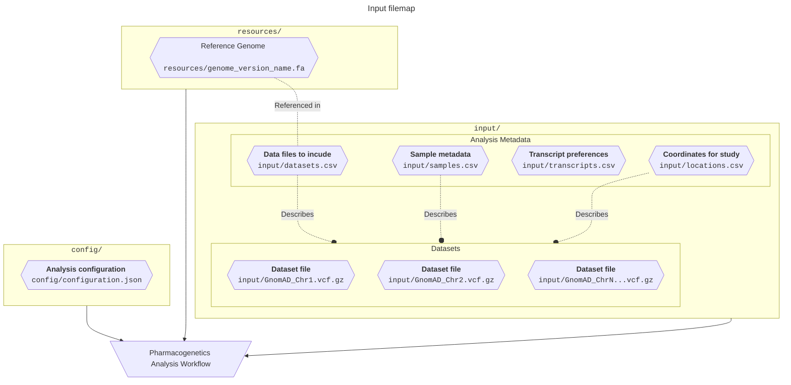

# Data
{: .no_toc}

A summary of the required data and input files needed to perform an analysis.
{: .fs-6 .fw-300 }

Datasets
{: .label }

Sample Metadata
{: .label }

Genomic Location Metadata
{: .label }

Transcript Selection
{: .label }

  

    Table of contents
  

  {: .text-delta }
1. TOC
{:toc}

---

This page lists the information needed to run the _{{ site.title }}_. Below we guide users through the system used to declare an analysis manifest, and all associated metadata files. For more information, please consult the relevant section below which contains more specific guidance, discussions and technical documentation.

## Overview

This workflow makes use of an analysis manifest to encapsulate all analysis variables used. This manifest file collects and connects the metadata for your samples, datasets, and relevant reference resources (Reference Genomes, etc) together. Doing so allows the workflow to programmatically access clusters through sample annotations, which is required in order to produce cluster-level reports.

  

    Input Data Infographic
  

  {: .text-delta }





## Analysis Datasets

This workflow is designed to work on variant-call-format files (<code>.vcf</code> file extension). The latest version of the VCF specification can be found [here](https://samtools.github.io/hts-specs/VCFv4.3.pdf).

### Dataset Subdivisions

The VCF files provided for analysis should be split by contigs. This convention reduces unnecessary processing times associated with genomic content that is not relevant to the coordinates being targeted.

### Dataset Compression and Indexing

VCF datasets are often quite large in uncompressed form. These files are text-based, and require parsing that reduces I/O performance. They are prone to large sizes by nature, and can contain variable-length annotation columns. For these reasons, this workflow has been configured to convert to remove annotation columns, and perform BGZip-compression and tabix-indexing for the sake of computational efficiency.

{: .normal }
> <b>Block Compression</b> is a non-standard type of compression. This means it is not the same as the default compression type used on Windows or MacOS. At a high level, it is used to compress files in a series of blocks or chunks. It is typically used in tandem with some kind of index, to enable targeted decompression and access of specific records. This eliminates the need to decompress the whole file.
>
> In computational biology applications, block-compression is combined with a <b>Tabix Index</b> to record the coordinate coverage/bounds in each compressed block. This allows targeted decompression of spesific regions for analysis, as opposed to having to parse the entire file until the requested coordinates are found.
>
> Both block-compression and tabix indexing are provided by [SamTools](http://www.htslib.org/doc/bgzip.html).

## Analysis Metadata

All metadata is provided in the form of appropriately named ` .csv` files located in the input directory:

<h3><code>datasets.csv</code></h3>

The `datasets.csv` file allows you to declare datasets and provide the necessary information to determine which contig-level files should be used for analysis given the provided genomic coordinates.

  

    <code>datasets.csv</code> format example
  

  {: .text-delta }

<dl class="def-wide">
  <dt>dataset_name <code>&lt;str&gt;</code></dt>
  <dd>The name of the dataset. This value will be used as a universal accessor for that dataset and any information relating to it. This means that any output files will use this value to determine things like filenames, etc. It is also used to connect other metadata to this dataset computationally, E.g. sample-level information.
  
   <strong><i>E.g. <code>1000G</code></i></strong></dd>
  
  <dt>reference_genome <code>&lt;str&gt;</code></dt>
  <dd>An <code>enum</code> indicating which reference genome version this dataset has been called on.
  
   <strong><i>E.g. <code>GRCh37</code> or <code>GRCh38</code></i></strong></dd>
  
  <dt>file <code>&lt;file_path&gt;</code></dt>
  <dd>A file path indicating the location of the dataset to be used in the analysis.
  
   <strong><i>E.g. <code>GRCh37</code> or <code>GRCh38</code></i></strong></dd>
</dl>

| **dataset_name** | **reference_genome** | **file**                                                    |
| :--------------- | :------------------- | :---------------------------------------------------------- |
| HG002            | GRCh38               | `/nlustre/users/graeme/PUBLIC/GenomeInABottle/HG002.vcf.gz` |
| HG002            | GRCh38               | `/nlustre/users/graeme/PUBLIC/GenomeInABottle/HG002.vcf.gz` |
| HG002            | GRCh38               | `/nlustre/users/graeme/PUBLIC/GenomeInABottle/HG002.vcf.gz` |

---
<h3><code>samples.csv</code></h3>

The `samples.csv` file allows you to declare samples and provide the necessary sample-level information for use in this pipeline.

  

   <code>samples.csv</code> format example
  

  {: .text-delta }

{: .highlight-title }
> Case Sensitive
>
> The following metadata declaration files use _**case-sensitive column names**_.

<dl class="def-wide">
  <dt>sample_name <code>&lt;str&gt;</code></dt>
  <dd>The ID of the sample. this should correspond to the sample ID's provided in the provided <code>.vcf</code> file. 
  
   <strong><i>E.g. <code>HG002</code></i></strong></dd>
  
  <dt>dataset <code>&lt;enum [dataset_name]&gt;</code></dt>
  <dd>The name of the dataset this sample belongs to. This value should correspond to the provided dataset ID listed in <code>datasets.csv</code> 
  
   <strong><i>E.g. <code>1000g</code></i></strong></dd>
  
  <dt><code>* &lt;str&gt;</code></dt>
  <dd>A file path indicating the location of the dataset to be used in the analysis. Please note that the column names are <b><i><u>case-sensitive</u></i></b>.
  
   <strong><i>E.g. <code>GRCh37</code> or <code>GRCh38</code></i></strong></dd>
</dl>
| **sample_name** | **dataset** | **SUPER** | **SUB** |
| :-------------- | :---------- | :-------- | :------ |
| HG002           | HG002       | `EUR`     | `GBR`   |
| HG002           | HG003       | `AFR`     | `GWD`   |
| HG002           | HG004       | `SAS`     | `GIH`   |

---
<h3><code>locations.csv</code></h3>

The `locations.csv` file allows you to declare samples and provide the necessary sample-level information for use in this pipeline.

  

    <code>locations.csv</code> format example
  

  {: .text-delta }

<dl class="def-wide">
  <dt>location_name <code>&lt;str&gt;</code></dt>
  <dd>The ID of a gene or, if not a studied gene region, a unique identifier to reference this genomic coordinate window.
  
   <strong><i>E.g. <code>CYP2A6</code></i></strong></dd>
  
  <dt>chromosome <code>&lt;enum &lt;int [0-24]&gt; &gt;</code></dt>
  <dd>The chromosome number on which the above genomic region can be found.
  
   <strong><i>E.g. <code>19</code></i></strong></dd>

  <dt>start <code>&lt;int&gt;</code></dt>
  <dd>The start coordinates for the genomic window.
  
   <strong><i>E.g. <code>40842850</code></i></strong></dd>
  
  <dt>stop <code>&lt;int&gt;</code></dt>
  <dd>The stop coordinates for the genomic window.
  
   <strong><i>E.g. <code>1000g</code></i></strong></dd>
  
  <dt>strand <code>&lt;enum [-1,1]&gt;</code></dt>
  <dd>The strand on which the genomic region can be found, where <code>1</code> denotes the forward strand and <code>-1</code> denotes the reverse strand.
  
   <strong><i>E.g. <code>-1</code></i></strong></dd>
</dl>
| **location_name** | **chromosome** | **start** | **stop**  | **strand** |
| :---------------- | :------------- | :-------- | :-------- | :--------- |
| CYP2A6            | 19             | 40842850  | 40851138  | -1         |
| CYP2B6            | 19             | 40988570  | 41021110  | 1          |
| UGT2B7            | 4              | 69045214  | 69112987  | 1          |

---
### <code>transcripts.csv</code>

The `transcripts.csv` file allows you to declare which transcripts you would like to use when performing variant-effect-prediction.

During the execution of the _{{ site.title }}_, variant-effect-prediction (VEP) is performed using a publicly accessible VEP query API by E! Ensembl. Currently, the API returns multiple VEP predictions based on any transcripts that are found matching the requested genomic location. Users are able to provide a <code>transcripts.csv</code> input file to declare a list of transcripts per genomic-region they would like to consider for this analysis.

{: .normal-title }
> Transcript IDs
>
>Please use transcripts listed on the [E! Ensembl Database](https://www.ensembl.org/)

{: .normal-title }
> Multiple Transcripts
>
> If more than one transcript is provided for a given genomic region, we will attempt to match the transcripts available in the order that is provided from top to bottom. The first successful VEP transcript match between the users selection and that provided by E! Ensembl will be selected, and if no transcripts provided are available, the first available transcript result will be selected.

#### Data requirements

<dl class="def-wide">
  <dt>gene_name <code>&lt;enum [str]&gt;</code></dt>
  <dd>The name of the gene a transcript describes. This key should match the gene or region name provided in the <code>locations.csv</code> file. 
  
   <strong><i>E.g. <code>HG002</code></i></strong></dd>
  
  <dt>transcript_id <code>&lt;str&gt;</code></dt>
  <dd>The name of the transcript in question. This value will be used to query the E! Ensembl database when performing variant-effect-prediction. 
  
   <strong><i>E.g. <code>NM_000762.6</code></i></strong></dd>
</dl>

  

    <code>transcripts.csv</code> format example
  

| **gene_name** | **transcript_id**   |
| :------------ | :------------------ |
| CYP2A6        | NM_000762.6         |
| CYP2A6        | ENST00000600495.1   |
| CYP2A6        | ENST00000596719.5   |
| CYP2A6        | ENST00000599960.1   |
| CYP2B6        | NM_000767.5         |
| CYP2B6        | ENST00000593831.1   |
| CYP2B6        | ENST00000598834.2   |
| CYP2B6        | ENST00000597612.1   |
| CYP2B6        | ENST00000594187.1   |
| UGT2B7        | NM_001074.4         |
| UGT2B7        | ENST00000508661.5   |
| UGT2B7        | ENST00000622664.1   |
| UGT2B7        | ENST00000502942.5   |
| UGT2B7        | ENST00000509763.1   |

## Reference Genome

Reference Genomes are considered a 'resource', given that they are versioned and in many cases, may be analysis-specific and non-standard. As such, they are housed under the `resources` folder, and need to be provisioned and maintained separately.
