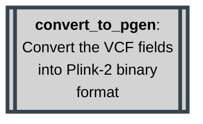
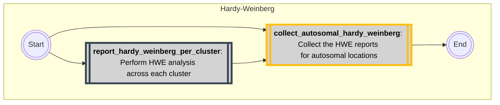

# Methodology
{: .no_toc }

An in-depth overview of each step in the workflow.
{: .fs-6 .fw-300 }

Plink-2
{: .label }

BcfTools
{: .label }

Piccard
{: .label }


<details markdown="block">
  <summary>
    Table of contents
  </summary>
  {: .text-delta }
1. TOC
{:toc}
</details>

---

## Rule Map/Diagram

```mermaid
---
title: Pharmacogenetics Analysis
---
flowchart TD
    START(((Input Files)))
    click START href "/workflow/data" _blank

    ValidateVcfWorkflow[\Validate VCF Workflow/]
    click ValidateVcfWorkflow href "https://tuks-icmm.github.io/VCF-Validation-Workflow/workflow/methodology" _blank

    START --> ValidateVcfWorkflow --> multipleVcfProtocol
    START --> format_sample_metadata

    subgraph pharmacogeneticsWorkflow [Pharmacogenetics Workflow]
        direction BT

        classDef bcftools stroke:#FF5733,fill:#D3D3D3,stroke-width:4px,color:black;
        classDef plink stroke:#36454F,fill:#D3D3D3,stroke-width:4px,color:black;
        classDef python stroke:#FEBE10,fill:#D3D3D3,stroke-width:4px,color:black;
        classDef admixture stroke:#333,fill:#D3D3D3,stroke-width:4px,color:black;
        classDef tabix stroke:#023020,fill:#D3D3D3,stroke-width:4px,color:black;
        classDef gatk stroke:#007FFF,fill:#D3D3D3,stroke-width:4px,color:black;
        classDef workflow stroke:#fff,fill:#000000,stroke-width:4px,color:white;

        subgraph multipleVcfProtocol [Multiple dataset protocol]
            direction LR
            multipleVcfProtocolStart(((Start)))
            ifMergeRequired{Is a <br>merge needed?}
            merge_datasets[[<b>merge_datasets</b>: <br>Merge multiple incoming <br>datasets]]

            normalize_merged_datasets[[<b>normalize_merged_datasets</b>: <br>normalize any multi-allelic <br>records created by merge]]
            multipleVcfProtocolEnd(((End)))

            class merge_datasets,normalize_merged_datasets bcftools;
            multipleVcfProtocolStart --> ifMergeRequired
            ifMergeRequired --> |yes| merge_datasets --> normalize_merged_datasets --> multipleVcfProtocolEnd
            ifMergeRequired --> |No| multipleVcfProtocolEnd
        end

        format_sample_metadata[[<b>format_sample_metadata</b>: <br>Transpile cluster ownership <br>from sample cluster assignment <br>into input format]]

        convert_to_pgen[[<b>convert_to_pgen</b>: <br>Convert the VCF fields <br>into Plink-2 binary <br>format]]

        verify_records_against_reference_genome[[<b>verify_records_against_reference_genome</b>: <br>Check reference alleles against <br>provided reference genome]]

        remove_non_standard_chromosomes[[<b>remove_non_standard_chromosomes</b>: <br>Filter out non-standard <br>chromosomes]]
        
        remove_unknown_samples[[<b>remove_unknown_samples</b>: <br>Subset samples to labeled <br>samples in metadata files]]
        
        filter_variant_missingness[[<b>filter_variant_missingness</b>: <br>Filter variants with 100% <br>missingness]]
        
        filter_sample_missingness[[<b>filter_sample_missingness</b>: <br>Filter samples with 100% <br>missingness]]

        calculate_sample_relatedness[[<b>calculate_sample_relatedness</b>: <br>Calculate relatedness]]

        remove_related_samples[[<b>remove_related_samples</b>: <br>remove a given list of <br>samples which are too <br>closely related]]

        extract_provided_coordinates[[<b>extract_provided_coordinates</b>: <br>Trim the dataset to one <br>of the studied regions]]

        subgraph variant_count[Variant Count]
            variant_count_START(((Start)))
            variant_count_END(((End)))
            report_count_partitioned_per_cluster[[<b>report_count_partitioned_per_cluster</b>: <br>Perform frequency analysis <br>across each cluster]]
            collect_variant_frequency[[<b>collect_variant_frequency</b>: <br>Collect cluster-level <br>variant frequency reports <br>into one]]
            collect_variant_count[[<b>collect_variant_count</b>: <br>Collect all per-cluster <br>variant count reports <br>into one]]

            variant_count_START --> report_count_partitioned_per_cluster & collect_variant_frequency & collect_variant_count
            report_count_partitioned_per_cluster --> collect_variant_frequency
            report_count_partitioned_per_cluster --> collect_variant_count

            collect_variant_count & collect_variant_frequency --> variant_count_END
        end

        subgraph hardy_weinberg[Hardy-Weinberg]
            hardy_weinberg_START(((Start)))
            hardy_weinberg_END(((End)))
            report_hardy_weinberg_per_cluster[[<b>report_hardy_weinberg_per_cluster</b>: <br>Perform HWE analysis <br>across each cluster]]
            collect_autosomal_hardy_weinberg[[<b>collect_autosomal_hardy_weinberg</b>: <br>Collect the HWE reports <br>for autosomal locations]]

            hardy_weinberg_START --> report_hardy_weinberg_per_cluster & collect_autosomal_hardy_weinberg
            report_hardy_weinberg_per_cluster --> collect_autosomal_hardy_weinberg
            collect_autosomal_hardy_weinberg --> hardy_weinberg_END
        end

        subgraph variant_missingness[Variant Missingness]
            variant_missingness_START(((Start)))
            variant_missingness_END(((End)))
            report_missingness_per_cluster[[<b>report_missingness_per_cluster</b>: <br>Report the missingness rates <br>observed across each cluster]]

            collect_variant_missingness[[<b>collect_variant_missingness</b>: <br>Collect all per-cluster <br>variant missingness reports <br>into one]]
            variant_missingness_START --> report_missingness_per_cluster & collect_variant_missingness
            report_missingness_per_cluster --> collect_variant_missingness
            collect_variant_missingness --> variant_missingness_END
        end

        subgraph vep[Variant Effect Prediction]
            vep_START(((Start)))
            vep_END(((End)))
            query_variant_effect_predictions[[<b>query_variant_effect_predictions</b>: <br>Perform API calls to <br>E! Ensemble REST API to <br>identify variants]]
            compile_variant_effect_predictions[[<b>compile_variant_effect_predictions</b>: <br>Collect the RAW API <br>payloads and extract <br>relevant metrics]]
            
            vep_START --> query_variant_effect_predictions & compile_variant_effect_predictions
            query_variant_effect_predictions --> compile_variant_effect_predictions
            compile_variant_effect_predictions --> vep_END
        end

        subgraph fishers_exact[Fishers Exact w/t Bonferoni Correction]
            fishers_exact_START(((Start)))
            fishers_exact_END(((End)))
            report_fishers_exact_with_corrections[[<b>report_fishers_exact_with_corrections</b>: <br>Perform Fishers-Exact test <br>with Bonferonni correction]]

            fishers_exact_START --> report_fishers_exact_with_corrections --> fishers_exact_END
        end






        consolidate_reports[[<b>consolidate_reports</b>: <br>Consolidate all the <br>generated reports <br>into one]]

        class format_sample_metadata,query_variant_effect_predictions,compile_variant_effect_predictions,collect_autosomal_hardy_weinberg,collect_variant_count,collect_variant_frequency,collect_variant_missingness,report_fishers_exact_with_corrections,consolidate_reports python;

        class convert_to_pgen,verify_records_against_reference_genome,filter_variant_missingness,filter_sample_missingness,remove_non_standard_chromosomes,remove_unknown_samples,calculate_sample_relatedness,remove_related_samples,extract_provided_coordinates,report_count_partitioned_per_cluster,report_hardy_weinberg_per_cluster,report_missingness_per_cluster plink;

        remove_related_samples --> extract_provided_coordinates
        format_sample_metadata --> extract_provided_coordinates 
        
        
        multipleVcfProtocol --> convert_to_pgen
        format_sample_metadata --> convert_to_pgen
        convert_to_pgen --> verify_records_against_reference_genome
        verify_records_against_reference_genome --> remove_non_standard_chromosomes
        remove_non_standard_chromosomes --> remove_unknown_samples
        remove_unknown_samples --> filter_variant_missingness
        filter_variant_missingness --> filter_sample_missingness
        

        filter_sample_missingness --> calculate_sample_relatedness --> remove_related_samples
        filter_sample_missingness --> remove_related_samples

        query_variant_effect_predictions --> compile_variant_effect_predictions


        extract_provided_coordinates --> variant_count & hardy_weinberg & vep & variant_missingness & fishers_exact

        variant_count & hardy_weinberg & vep & variant_missingness & fishers_exact --> consolidate_reports
    end


    PopulationStructureWorkflow[\Population Structure Workflow/]
    click PopulationStructureWorkflow href "https://tuks-icmm.github.io/Population-Structure-Workflow/workflow/methodology" _blank

    class PopulationStructureWorkflow,ValidateVcfWorkflow workflow;

    remove_related_samples --> PopulationStructureWorkflow


    END((Results))

    consolidate_reports --> END

    PopulationStructureWorkflow --> END
```



## Workflow Rules Explained

Below, each rule in the workflow has been broken down and explained for convenience. In teh case of nested protocols, these are summarized and explained below in nested dropdowns.

<details markdown="block">
<summary>
  <code>format_sample_metadata</code>
</summary>
  
  ```mermaid
  flowchart TD
    format_sample_metadata[[<b>format_sample_metadata</b>: <br>Transpile cluster ownership <br>from sample cluster assignment <br>into input format]]

    classDef python stroke:#FEBE10,fill:#D3D3D3,stroke-width:4px,color:black;
    class format_sample_metadata python;
  ```

A python script which uses Pandas to convert the provided `samples.csv` into a format suitable for Plink-2.

</details>

<details markdown="block">
<summary>merge protocol *</summary>
  
  ```mermaid
  flowchart TD
    subgraph multipleVcfProtocol [Multiple dataset protocol]
            direction LR
            multipleVcfProtocolStart(((Start)))
            ifMergeRequired{Is a <br>merge needed?}
            merge_datasets[[<b>merge_datasets</b>: <br>Merge multiple incoming <br>datasets]]

            normalize_merged_datasets[[<b>normalize_merged_datasets</b>: <br>normalize any multi-allelic <br>records created by merge]]
            multipleVcfProtocolEnd(((End)))

            class merge_datasets,normalize_merged_datasets bcftools;
            multipleVcfProtocolStart --> ifMergeRequired
            ifMergeRequired --> |yes| merge_datasets --> normalize_merged_datasets --> multipleVcfProtocolEnd
            ifMergeRequired --> |No| multipleVcfProtocolEnd

            classDef bcftools stroke:#FF5733,fill:#D3D3D3,stroke-width:4px, color:black;
            class merge_datasets,normalize_merged_datasets bcftools;
        end
  ```

  {: .normal }
  > The merge rule is protected by a decision tree and only executes when multiple described datasets are detected. This rule is responsible for merging multiple datasets into a single VCF file, suitable for collective analysis.

  <details markdown="block">
  <summary><code>merge_datasets</code></summary>

  ```mermaid
  flowchart TD
      merge_datasets[[<b>merge_datasets</b>: <br>Merge multiple incoming <br>datasets]]
      
      classDef bcftools stroke:#FF5733,fill:#D3D3D3,stroke-width:4px,color:black;
      class merge_datasets bcftools;
  ```

  <dl>
    <dt>Function</dt>
    <dd>Merge multiple incoming VCF files into a single VCF file.</dd>
    <dt>Command</dt>
    <dd><code>bcftools merge -O z -o {output} {input.vcf}</code></dd>
    <dt>Parameters</dt>
    <dd>
        <dl>
        <dt><code>-O z</code></dt>
        <dd>Output format (<code>-Oz</code> denotes a BG-Zipped VCF output)</dd>
        <dt><code>-o {output.vcf}</code></dt>
        <dd>Output file.</dd>
        </dl>
    </dd>
  </dl>
  </details>

  <details markdown="block">
  <summary><code>normalize_merged_datasets</code></summary>

  ```mermaid
  flowchart TD
      normalize_merged_datasets[[<b>normalize_merged_datasets</b>: <br>normalize any multi-allelic <br>records created by merge]]
              
      normalize_merged_datasets[[**normalize_merged_datasets**: normalize any multi-allelic records created by merge]]

      classDef bcftools stroke:#FF5733,fill:#D3D3D3,stroke-width:4px,color:black;
      class normalize_merged_datasets bcftools;
  ```

  <dl>
    <dt>Function</dt>
    <dd>To normalize any multi-allelic records which may arise as a result of the merge.</dd>
    <dt>Command</dt>
    <dd><code>bcftools norm --multiallelics - -any -Oz -o {output} {input}</code></dd>
    <dt>Parameters</dt>
    <dd>
        <dl>
        <dt><code>--multiallelics -</code></dt>
        <dd>Split multi-allelic records into bi-allelic records.</dd>
        <dt><code>-O z</code></dt>
        <dd>Output format (<code>-Oz</code> denotes a BG-Zipped VCF output).</dd>
        <dt><code>-o {output.vcf}</code></dt>
        <dd>Output file.</dd>
        </dl>
    </dd>
  </dl>
  </details>
</details>


<details markdown="block">
<summary>
  <code>convert_to_pgen</code>
</summary>



<dl>
    <dt>Function</dt>
    <dd>To convert text-based VCF files into binary Plink-2 PGEN format which is much more performant.</dd>
    <dt>command</dt>
    <dd><code>plink2 --threads {threads} --vcf {input.vcf} --update-sex {input.sample_metadata} --split-par hg38 --allow-extra-chr --make-pgen vzs --out {params.output}</code></dd>
    <dt>Parameters</dt>
    <dd>
        <dl>
            <dt><code>--threads {threads}</code></dt>
            <dd>Used to set the number of CPU threads used during this calculation</dd>
            <dt><code>--vcf {input.vcf}</code></dt>
            <dd>Used to provide the location of the input file plink needs to work on.</dd>
            <dt><code>--update-sex {input.sample_metadata}</code></dt>
            <dd>Used to provide plink with sample annotations for downstream processing and use.</dd>
            <dt><code>--split-par hg38</code></dt>
            <dd>Used to indicate to plink to use standard coordinates for build hg38 when trimming off the PAR regions on chromosome X.</dd>
            <dt><code>--allow-extra-chr</code></dt>
            <dd>Used to indicate to Plink to expect non-standard chromosomes.</dd>
            <dt><code>--make-pgen vzs</code></dt>
            <dd>Used to indicate that output should be compiled in Plink-2 binary format (.pvar, .pgen and .psam files).</dd>
            <dt><code>--out {params.output}</code></dt>
            <dd>Used to declare the output location that should be used to create the file. File is specified without extension, which is added by Plink.</dd>
        </dl>
    </dd>
</dl>

</details>


<details markdown="block">
  <summary>
    <code>verify_records_against_reference_genome</code>
  </summary>
  
  ```mermaid
  flowchart TD
    verify_records_against_reference_genome[[<b>verify_records_against_reference_genome</b>: <br>Check reference alleles against <br>provided reference genome]]

    classDef plink stroke:#36454F,fill:#D3D3D3,stroke-width:4px,color:black;
    class verify_records_against_reference_genome plink;
  ```

 <dl>
      <dt>Function</dt>
      <dd>
      To check each loci and comparing its listed reference to that provided in the reference genome.</dd>
      <dt>Command</dt>
      <dd><code>plink2 --threads {threads} --pfile {params.input} vzs --fa {params.ref} --ref-from-fa force --allow-extra-chr --make-pgen vzs --out {params.output}</code></dd>
      <dt>Parameters</dt>
      <dd>
        <dl>
          <dt><code>--threads {threads}</code></dt>
          <dd>Used to set the number of CPU threads used during this calculation</dd>
          <dt><code>--pfile {params.input} vzs</code></dt>
          <dd>Used to provide plink with the location of a plink-2 binary file set (.psam, .pvar and .pgen files), and to expect z-compressed files.</dd>
          <dt><code>--fa {params.ref}</code></dt>
          <dd>File path to reference genome to be used for comparison.</dd>
          <dt><code>--ref-from-fa force</code></dt>
          <dd>Sets REF allele to provided reference FASTA when possible unambiguously (Does not apply to some INDELS)</dd>
          <dt><code>--threads {threads}</code></dt>
          <dd>Used to set the number of CPU threads used during this calculation</dd>
          <dt><code>--pfile {params.input} vzs</code></dt>
          <dd>Used to provide plink with the location of a plink-2 binary file set (.psam, .pvar and .pgen files), and to expect z-compressed files.</dd>
          <dt><code>--make-pgen zs</code></dt>
          <dd>Save output to a BG-Zipped pgen binary fileset.</dd>
          <dt><code>--out {params.output}</code></dt>
          <dd>Provide the file name and path for output creation.</dd>
        </dl>
      </dd>
    </dl>

</details>

<details markdown="block">
  <summary>
    <code>remove_non_standard_chromosomes</code>
  </summary>

  ```mermaid
  flowchart TD
    remove_non_standard_chromosomes[[<b>remove_non_standard_chromosomes</b>: <br>Filter out non-standard <br>chromosomes]]

    classDef plink stroke:#36454F,fill:#D3D3D3,stroke-width:4px,color:black;
    class remove_non_standard_chromosomes plink;
  ```

 <dl>
      <dt>Function</dt>
      <dd>
      To filter out non-standard chromosomes.</dd>
      <dt>Command</dt>
      <dd><code>plink2 --threads {threads} --pfile {params.input} vzs --allow-extra-chr --output-chr chr26 --chr 1-26 --make-pgen vzs --out {params.output}</code></dd>
      <dt>Parameters</dt>
      <dd>
        <dl>
          <dt><code>--threads {threads}</code></dt>
          <dd>Used to set the number of CPU threads used during this calculation</dd>
          <dt><code>--pfile {params.input} vzs</code></dt>
          <dd>Used to provide plink with the location of a plink-2 binary file set (.psam, .pvar and .pgen files), and to expect z-compressed files.</dd>
          <dt><code>--allow-extra-chr</code></dt>
            <dd>Used to indicate to Plink to expect non-standard chromosomes.</dd>
          <dt><code>--output-chr chr26</code></dt>
          <dd>Sets chromosome code notation in output files to include the 'chr' as a prefix.</dd>
          <dt><code>--chr 1-26</code></dt>
          <dd>Request a subset of chromosomes to be included in the output file.</dd>
          <dt><code>--make-pgen zs</code></dt>
          <dd>Save output to a BG-Zipped pgen binary fileset.</dd>
          <dt><code>--out {params.output}</code></dt>
          <dd>Provide the file name and path for output creation.</dd>
        </dl>
      </dd>
    </dl>

</details>


<details markdown="block">
  <summary>
    <code>remove_unknown_samples</code>
  </summary>

  ```mermaid
  flowchart TD
    remove_unknown_samples[[<b>remove_unknown_samples</b>: <br>Subset samples to labeled <br>samples in metadata files]]

    classDef plink stroke:#36454F,fill:#D3D3D3,stroke-width:4px,color:black;
    class remove_unknown_samples plink;
  ```

 <dl>
      <dt>Function</dt>
      <dd>
      To remove unneeded samples. This is done by comparison against all provided sample annotations in the <code>input/samples.csv</code> metadata file.</dd>
      <dt>Command</dt>
      <dd><code>plink2 --threads {threads} --pfile {params.input} vzs --keep {input.sample_metadata} --make-pgen vzs --out {params.output} >{log} 2>&1
        </code></dd>
      <dt>Parameters</dt>
      <dd>
        <dl>
          <dt><code>--threads {threads}</code></dt>
          <dd>Used to set the number of CPU threads used during this calculation</dd>
          <dt><code>--pfile {params.input} vzs</code></dt>
          <dd>Used to provide plink with the location of a plink-2 binary file set (.psam, .pvar and .pgen files), and to expect z-compressed files.</dd>
          <dt><code>--keep {input.sample_metadata}</code></dt>
          <dd>Keep only samples mentioned by name in provided <code>samples.csv</code></dd>
          <dt><code>--make-pgen zs</code></dt>
          <dd>Save output to a BG-Zipped pgen binary fileset.</dd>
          <dt><code>--out {params.output}</code></dt>
          <dd>Provide the file name and path for output creation.</dd>
        </dl>
      </dd>
    </dl>

</details>

<details markdown="block">
  <summary>
    <code>filter_variant_missingness</code>
  </summary>

  ```mermaid
  flowchart TD
    filter_variant_missingness[[<b>filter_variant_missingness</b>: <br>Filter variants with 100% <br>missingness]]

    classDef plink stroke:#36454F,fill:#D3D3D3,stroke-width:4px,color:black;
    class filter_variant_missingness plink;
  ```

 <dl>
      <dt>Function</dt>
      <dd>
      To manage and remove regions of missing calls along the variant-level.</dd>
      <dt>Command</dt>
      <dd><code>plink2 --threads {threads} --pfile {params.input} vzs  --geno 1.0 --make-pgen vzs --out {params.output}</code></dd>
      <dt>Parameters</dt>
      <dd>
        <dl>
          <dt><code>--threads {threads}</code></dt>
          <dd>Used to set the number of CPU threads used during this calculation</dd>
          <dt><code>--pfile {params.input} vzs</code></dt>
          <dd>Used to provide plink with the location of a plink-2 binary file set (.psam, .pvar and .pgen files), and to expect z-compressed files.</dd>
          <dt><code>--geno 1.0</code></dt>
          <dd>Filters based on 100% variant missingness</dd>
          <dt><code>--make-pgen zs</code></dt>
          <dd>Save output to a BG-Zipped pgen binary fileset.</dd>
          <dt><code>--out {params.output}</code></dt>
          <dd>Output file.</dd>
        </dl>
      </dd>
    </dl>

</details>

<details markdown="block">
  <summary>
    <code>filter_sample_missingness</code>
  </summary>

  ```mermaid
  flowchart TD
    filter_sample_missingness[[<b>filter_sample_missingness</b>: <br>Filter samples with 100% <br>missingness]]

    classDef plink stroke:#36454F,fill:#D3D3D3,stroke-width:4px,color:black;
    class filter_sample_missingness plink;
  ```

 <dl>
      <dt>Function</dt>
      <dd>
      To manage and remove regions of missing calls along the sample-level.</dd>
      <dt>Command</dt>
      <dd><code>plink2 --threads {threads} --pfile {params.input} vzs --mind 1.0 --make-pgen vzs --out {params.output}</code></dd>
      <dt>Parameters</dt>
      <dd>
        <dl>
          <dt><code>--threads {threads}</code></dt>
          <dd>Used to set the number of CPU threads used during this calculation</dd>
          <dt><code>--pfile {params.input} vzs</code></dt>
          <dd>Used to provide plink with the location of a plink-2 binary file set (.psam, .pvar and .pgen files), and to expect z-compressed files.</dd>
          <dt><code>--mind 1.0</code></dt>
          <dd>Filters out samples with more than 100% missingness</dd>
          <dt><code>--make-pgen zs</code></dt>
          <dd>Save output to a BG-Zipped pgen binary fileset.</dd>
          <dt><code>--out {params.output}</code></dt>
          <dd>Provide the file name and path for output creation.</dd>
        </dl>
      </dd>
    </dl>

</details>

<details markdown="block">
  <summary>
    <code>calculate_sample_relatedness</code>
  </summary>

  ```mermaid
  flowchart TD
    calculate_sample_relatedness[[<b>calculate_sample_relatedness</b>: <br>Calculate relatedness]]

    classDef plink stroke:#36454F,fill:#D3D3D3,stroke-width:4px,color:black;
    class calculate_sample_relatedness plink;
  ```

 <dl>
      <dt>Function</dt>
      <dd>
      To calculate sample relatedness using a kingship estimator provided by Plink-2.</dd>
      <dt>Command</dt>
      <dd><code>plink2 --threads {threads} --pfile {params.input} vzs --king-cutoff 0.354 --out {params.output}</code></dd>
      <dt>Parameters</dt>
      <dd>
        <dl>
          <dt><code>--threads {threads}</code></dt>
          <dd>Used to set the number of CPU threads used during this calculation</dd>
          <dt><code>--pfile {params.input} vzs</code></dt>
          <dd>Used to provide plink with the location of a plink-2 binary file set (.psam, .pvar and .pgen files), and to expect z-compressed files.</dd>
          <dt><code>--king-cutoff 0.354</code></dt>
          <dd>Filters out samples which show a kingship estimator of greater than 0.354.</dd>
          <dt><code>--out {params.output}</code></dt>
          <dd>Provide the file name and path for output creation.</dd>
        </dl>
      </dd>
    </dl>

</details>

<details markdown="block">
  <summary>
    <code>remove_related_samples</code>
  </summary>

  ```mermaid
  flowchart TD
    calculate_sample_relatedness[[<b>calculate_sample_relatedness</b>: <br>Calculate relatedness]]

    classDef plink stroke:#36454F,fill:#D3D3D3,stroke-width:4px,color:black;
    class remove_related_samples plink;
  ```

 <dl>
      <dt>Function</dt>
      <dd>
      To filter out all but unrelated samples, given the list of samples to keep from its predecessor rules.</dd>
      <dt>Command</dt>
      <dd><code>plink2 --threads {threads} --pfile {params.input} vzs --keep {input.unrelated_samples} --make-pgen vzs --out {params.output}</code></dd>
      <dt>Parameters</dt>
      <dd>
        <dl>
          <dt><code>--threads {threads}</code></dt>
          <dd>Used to set the number of CPU threads used during this calculation</dd>
          <dt><code>--pfile {params.input} vzs</code></dt>
          <dd>Used to provide plink with the location of a plink-2 binary file set (.psam, .pvar and .pgen files), and to expect z-compressed files.</dd>
          <dt><code>--keep {input.sample_metadata}</code></dt>
          <dd>Keep only samples mentioned by name in provided <code>samples.csv</code></dd>
          <dt><code>--make-pgen zs</code></dt>
          <dd>Save output to a BG-Zipped pgen binary fileset.</dd>
          <dt><code>--out {params.output}</code></dt>
          <dd>Provide the file name and path for output creation.</dd>
        </dl>
      </dd>
    </dl>

</details>

<details markdown="block">
  <summary>
    <code>extract_provided_coordinates</code>
  </summary>

  ```mermaid
  flowchart TD
    extract_provided_coordinates[[<b>extract_provided_coordinates</b>: <br>Trim the dataset to one <br>of the studied regions]]

    classDef plink stroke:#36454F,fill:#D3D3D3,stroke-width:4px,color:black;
    class extract_provided_coordinates plink;
  ```

 <dl>
      <dt>Function</dt>
      <dd>
      To filter out all but unrelated samples, given the list of samples to keep from its predecessor rules.</dd>
      <dt>Command</dt>
      <dd><code>plink2 --threads {threads} --pfile {params.input} vzs --from-bp {params.fromBP} --to-bp {params.toBP} --chr {params.chr} --make-pgen vzs --out {params.output}</code></dd>
      <dt>Parameters</dt>
      <dd>
        <dl>
          <dt><code>--threads {threads}</code></dt>
          <dd>Used to set the number of CPU threads used during this calculation</dd>
          <dt><code>--pfile {params.input} vzs</code></dt>
          <dd>Used to provide plink with the location of a plink-2 binary file set (.psam, .pvar and .pgen files), and to expect z-compressed files.</dd>
          <dt><code>--from-bp</code></dt>
          <dd>The start co-ordinates to start trimming from.</dd>
          <dt><code>--to-bp</code></dt>
          <dd>The stop coordinates to trim until.</dd>
          <dt><code>--chr</code></dt>
          <dd>The chromosome on which the coordinates can be found.</dd>
          <dt><code>--make-pgen zs</code></dt>
          <dd>Save output to a BG-Zipped pgen binary fileset.</dd>
          <dt><code>--out {params.output}</code></dt>
          <dd>Provide the file name and path for output creation.</dd>
        </dl>
      </dd>
    </dl>

</details>

<details markdown="block">
  <summary>Allele Count and Frequency protocol</summary>

  ```mermaid
  ---
  config:
      flowchart:
          defaultRenderer: elk
  ---
  flowchart TD
    subgraph variant_count[Variant Count]
      variant_count_START(((Start)))
      variant_count_END(((End)))
      report_count_partitioned_per_cluster[[<b>report_count_partitioned_per_cluster</b>: <br>Perform frequency analysis <br>across each cluster]]
      collect_variant_frequency[[<b>collect_variant_frequency</b>: <br>Collect cluster-level <br>variant frequency reports <br>into one]]
      collect_variant_count[[<b>collect_variant_count</b>: <br>Collect all per-cluster <br>variant count reports <br>into one]]

      variant_count_START --> report_count_partitioned_per_cluster & collect_variant_frequency & collect_variant_count
      report_count_partitioned_per_cluster --> collect_variant_frequency
      report_count_partitioned_per_cluster --> collect_variant_count

      collect_variant_count & collect_variant_frequency --> variant_count_END


      classDef plink stroke:#36454F,fill:#D3D3D3,stroke-width:4px,color:black;
      class report_count_partitioned_per_cluster plink;

      classDef python stroke:#FEBE10,fill:#D3D3D3,stroke-width:4px,color:black;
      class collect_variant_frequency,collect_variant_count python;
    end
  ```

  This protocol is responsible for performing clustered variant count and frequency analysis. Two python scripts are used to collect the results of each clusters counts and frequencies respectively, and convert these into named columns for the final output.

  <details markdown="block">
  <summary>
    <code>report_count_partitioned_per_cluster</code>
  </summary>

  ```mermaid
  flowchart TD    
    report_count_partitioned_per_cluster[[<b>report_count_partitioned_per_cluster</b>: <br>Perform frequency analysis <br>across each cluster]]

    classDef plink stroke:#36454F,fill:#D3D3D3,stroke-width:4px,color:black;
    class report_count_partitioned_per_cluster plink;
  ```
  
  <dl>
      <dt>Function</dt>
      <dd>
      To generate a frequency report.</dd>
      <dt>Command</dt>
      <dd><code>plink2 --threads {threads} --pfile {params.input} vzs --loop-cats {wildcards.cluster} --freq counts cols=chrom,pos,ref,alt,reffreq,altfreq,nobs --out {params.output}</code></dd>
      <dt>Parameters</dt>
      <dd>
        <dl>
            <dt><code>--threads {threads}</code></dt>
          <dd>Used to set the number of CPU threads used during this calculation</dd>
          <dt><code>--pfile {params.input} vzs</code></dt>
          <dd>Used to provide plink with the location of a plink-2 binary file set (.psam, .pvar and .pgen files), and to expect z-compressed files.</dd>
          <dt><code>--loop-cats {wildcards.cluster}</code></dt>
          <dd>Perform the requested computation repeAtedly, sampeling across the provided clusters, as assigned via the provided <code>samples.csv</code></dd>
          <dt><code>--freq counts cols=chrom,pos,ref,alt,reffreq,altfreq,nobs</code></dt>
          <dd>Calculate the frequency of each variant record. Include the following columns:
            <ul>
                <li>Chromosome</li>
                <li>Position</li>
                <li>Reference Allele</li>
                <li>Alternate allele</li>
                <li>Reference allele frequency</li>
                <li>Alternate allele frequency</li>
                <li>Number of observations</li>
            </ul>
          </dd>
          <dt><code>--out {params.output}</code></dt>
          <dd>Provide the file name and path for output creation.</dd>  
        </dl>
      </dd>
    </dl>

  </details>
  
  <details markdown="block">
  <summary>
    <code>collect_variant_frequency</code>
  </summary>

  ```mermaid
  flowchart TD
    collect_variant_frequency[[<b>collect_variant_frequency</b>: <br>Collect cluster-level <br>variant frequency reports <br>into one]]

    classDef python stroke:#FEBE10,fill:#D3D3D3,stroke-width:4px,color:black;
    class collect_variant_frequency python;
  ```

  <dl>
    <dt>Function</dt>
    <dd>
    A python script to compile multiple cluster-level variant-frequency results into a single report.</dd>
  </dl>
</details>

<details markdown="block">
<summary>
  <code>collect_variant_count</code>
</summary>

  ```mermaid
  flowchart TD
    collect_variant_count[[<b>collect_variant_count</b>: <br>Collect all per-cluster <br>variant count reports <br>into one]]

    classDef python stroke:#FEBE10,fill:#D3D3D3,stroke-width:4px,color:black;
    class collect_variant_count python;
  ```

  <dl>
    <dt>Function</dt>
    <dd>
    A python script to compile multiple cluster-level variant-count results into a single report.</dd>
  </dl>
  </details>
</details>

<details markdown="block">
  <summary>Hardy-Weinberg Protocol</summary>



  <details markdown="block">
  <summary>
    <code>report_hardy_weinberg_per_cluster</code>
  </summary>

  ```mermaid
  flowchart TD
    report_hardy_weinberg_per_cluster[[<b>report_hardy_weinberg_per_cluster</b>: <br>Perform HWE analysis <br>across each cluster]]

    classDef plink stroke:#36454F,fill:#D3D3D3,stroke-width:4px,color:black;
    class report_hardy_weinberg_per_cluster plink;
  ```

  <dl>
    <dt>Function</dt>
    <dd>
    To generate a hardy-weinberg report.</dd>
    <dt>Command</dt>
    <dd><code>plink2 --threads {threads} --pfile {params.input} vzs --loop-cats {wildcards.cluster} --hardy midp cols=chrom,pos,ref,alt,gcounts,hetfreq,p --out {params.output}</code></dd>
    <dt>Parameters</dt>
    <dd>
      <dl>
        <dt><code>--threads {threads}</code></dt>
        <dd>Used to set the number of CPU threads used during this calculation</dd>
        <dt><code>--pfile {params.input} vzs</code></dt>
        <dd>Used to provide plink with the location of a plink-2 binary file set (.psam, .pvar and .pgen files), and to expect z-compressed files.</dd>
        <dt><code>--loop-cats {wildcards.cluster}</code></dt>
        <dd>Perform the requested computation repeAtedly, sampeling across the provided clusters, as assigned via the provided <code>samples.csv</code></dd>
        <dt><code>--hardy midp cols=chrom,pos,ref,alt,gcounts,hetfreq,p</code></dt>
        <dd>Perform equilibrium, test on each variant record. Include the following columns:
          <ul>
              <li>Chromosome</li>
              <li>Position</li>
              <li>Reference Allele</li>
              <li>Alternate allele</li>
              <li>Genotype counts</li>
              <li>Heterozygote frequency</li>
              <li>P-value</li>
          </ul>
        </dd>
        <dt><code>--out {params.output}</code></dt>
        <dd>Provide the file name and path for output creation.</dd>  
      </dl>
    </dd>
  </dl>
  </details>

  <details markdown="block">
  <summary>
    <code>collect_autosomal_hardy_weinberg</code>
  </summary>

  ```mermaid
  flowchart TD
    collect_autosomal_hardy_weinberg[[<b>collect_autosomal_hardy_weinberg</b>: <br>Collect the HWE reports <br>for autosomal locations]]

    classDef python stroke:#FEBE10,fill:#D3D3D3,stroke-width:4px,color:black;
    class collect_autosomal_hardy_weinberg python;
  ```

  <dl>
    <dt>Function</dt>
    <dd>
    A python script to compile multiple cluster-level autosomal hardy-weinberg results into a single report.</dd>
  </dl>
  </details>
</details>

<details markdown="block">
  <summary>Missingness Protocol</summary>

  ```mermaid
  flowchart TD
    subgraph variant_missingness[Variant Missingness]
      variant_missingness_START(((Start)))
      variant_missingness_END(((End)))
      report_missingness_per_cluster[[<b>report_missingness_per_cluster</b>: <br>Report the missingness rates <br>observed across each cluster]]

      collect_variant_missingness[[<b>collect_variant_missingness</b>: <br>Collect all per-cluster <br>variant missingness reports <br>into one]]
      variant_missingness_START --> report_missingness_per_cluster & collect_variant_missingness
      report_missingness_per_cluster --> collect_variant_missingness
      collect_variant_missingness --> variant_missingness_END

      classDef plink stroke:#36454F,fill:#D3D3D3,stroke-width:4px,color:black;
      class report_missingness_per_cluster plink;

      classDef python stroke:#FEBE10,fill:#D3D3D3,stroke-width:4px,color:black;
      class collect_variant_missingness python;
    end
  ```

  <details markdown="block">
  <summary>
    <code>report_missingness_per_cluster</code>
  </summary>

  ```mermaid
  flowchart TD
    report_missingness_per_cluster[[<b>report_missingness_per_cluster</b>: <br>Report the missingness rates <br>observed across each cluster]]

    classDef plink stroke:#36454F,fill:#D3D3D3,stroke-width:4px,color:black;
    class report_missingness_per_cluster plink;
  ```

  <dl>
    <dt>Function</dt>
    <dd>
    To generate a missingness report.</dd>
    <dt>Command</dt>
    <dd><code>plink2 --threads {threads} --pfile {params.input} vzs --loop-cats {wildcards.cluster} --missing zs vcols=chrom,pos,ref,alt,provref,nmiss,nobs,fmiss --out {params.output}</code></dd>
    <dt>Parameters</dt>
    <dd>
      <dl>
        <dt><code>--threads {threads}</code></dt>
        <dd>Used to set the number of CPU threads used during this calculation</dd>
        <dt><code>--pfile {params.input} vzs</code></dt>
        <dd>Used to provide plink with the location of a plink-2 binary file set (.psam, .pvar and .pgen files), and to expect z-compressed files.</dd>
        <dt><code>--loop-cats {wildcards.cluster}</code></dt>
        <dd>Perform the requested computation repeAtedly, sampeling across the provided clusters, as assigned via the provided <code>samples.csv</code></dd>
        <dt><code>--missing zs vcols=chrom,pos,ref,alt,provref,nmiss,nobs,fmiss</code></dt>
        <dd>Perform missingness calculations on each variant record. Include the following columns:
          <ul>
              <li>Chromosome</li>
              <li>Position</li>
              <li>Reference Allele</li>
              <li>Alternate allele</li>
              <li>Provisional Reference</li>
              <li>Number of missing</li>
              <li>Number of observations</li>
              <li>Frequency of missingness</li>
          </ul>
        </dd>
        <dt><code>--out {params.output}</code></dt>
        <dd>Provide the file name and path for output creation.</dd>  
      </dl>
    </dd>
  </dl>
  </details>

  <details markdown="block">
  <summary>
    <code>collect_variant_missingness</code>
  </summary>

  ```mermaid
  flowchart TD
    collect_variant_missingness[[<b>collect_variant_missingness</b>: <br>Collect all per-cluster <br>variant missingness reports <br>into one]]

    classDef python stroke:#FEBE10,fill:#D3D3D3,stroke-width:4px,color:black;
    class collect_variant_missingness python;
  ```

  <dl>
    <dt>Function</dt>
    <dd>
    A python script to compile multiple cluster-level variant-missingness results into a single report.</dd>
  </dl>
  </details>
</details>

<details markdown="block">
  <summary>Fishers Exact Protocol</summary>

  ```mermaid
  flowchart TD
    subgraph fishers_exact[Fishers Exact w/t Bonferoni Correction]
      fishers_exact_START(((Start)))
      fishers_exact_END(((End)))
      report_fishers_exact_with_corrections[[<b>report_fishers_exact_with_corrections</b>: <br>Perform Fishers-Exact test <br>with Bonferonni correction]]

      fishers_exact_START --> report_fishers_exact_with_corrections --> fishers_exact_END

      classDef python stroke:#FEBE10,fill:#D3D3D3,stroke-width:4px,color:black;
      class report_fishers_exact_with_corrections python;
    end
  ```

  <details markdown="block">
  <summary>
    <code>report_fishers_exact_with_corrections</code>
  </summary>

  ```mermaid
  flowchart TD
    report_fishers_exact_with_corrections[[<b>report_fishers_exact_with_corrections</b>: <br>Perform Fishers-Exact test <br>with Bonferonni correction]]

    classDef python stroke:#FEBE10,fill:#D3D3D3,stroke-width:4px,color:black;
    class report_fishers_exact_with_corrections python;
  ```

  <dl>
    <dt>Function</dt>
    <dd>
    A python script to perform corrected Fishers-Exact test (Bonferoni method) to identify significant differences in variant frequency between clusters.</dd>
  </dl>

  </details>
</details>

<details markdown="block">
  <summary>Variant Effect Prediction Protocol</summary>

  ```mermaid
  flowchart TD
    subgraph vep[Variant Effect Prediction]
      vep_START(((Start)))
      vep_END(((End)))
      query_variant_effect_predictions[[<b>query_variant_effect_predictions</b>: <br>Perform API calls to <br>E! Ensemble REST API to <br>identify variants]]
      compile_variant_effect_predictions[[<b>compile_variant_effect_predictions</b>: <br>Collect the RAW API <br>payloads and extract <br>relevant metrics]]
      
      vep_START --> query_variant_effect_predictions & compile_variant_effect_predictions
      query_variant_effect_predictions --> compile_variant_effect_predictions
      compile_variant_effect_predictions --> vep_END

      classDef python stroke:#FEBE10,fill:#D3D3D3,stroke-width:4px,color:black;
      class query_variant_effect_predictions,compile_variant_effect_predictions python;
    end
  
  ```

  <details markdown="block">
  <summary>
    <code>query_variant_effect_predictions</code>
  </summary>

  ```mermaid
  flowchart TD
    query_variant_effect_predictions[[<b>query_variant_effect_predictions</b>: <br>Perform API calls to <br>E! Ensemble REST API to <br>identify variants]]

    classDef python stroke:#FEBE10,fill:#D3D3D3,stroke-width:4px,color:black;
    class query_variant_effect_predictions python;
  ```

  <dl>
    <dt>Function</dt>
    <dd>
    A python script to perform batched API calls to the <a href="https://rest.ensembl.org/#VEP">E! Ensembl REST APIs VEP tool</a> to retrieve and store cached variant annotations.</dd>
  </dl>
  </details>

  <details markdown="block">
  <summary>
    <code>compile_variant_effect_predictions</code>
  </summary>

  ```mermaid
  flowchart TD
    compile_variant_effect_predictions[[<b>compile_variant_effect_predictions</b>: <br>Collect the RAW API <br>payloads and extract <br>relevant metrics]]

    classDef python stroke:#FEBE10,fill:#D3D3D3,stroke-width:4px,color:black;
    class compile_variant_effect_predictions python;
  ```

  <dl>
    <dt>Function</dt>
    <dd>A python script to extract relevant metrics from the returned annotations.</dd>
  </dl>
  </details>
</details>

<details markdown="block">
  <summary>
    <code>consolidate_reports</code>
  </summary>

  ```mermaid
  flowchart TD
    consolidate_reports[[<b>consolidate_reports</b>: <br>Consolidate all the <br>generated reports <br>into one]]

    classDef python stroke:#FEBE10,fill:#D3D3D3,stroke-width:4px,color:black;
    class consolidate_reports python;
  ```

  <dl>
      <dt>Function</dt>
      <dd>
      A python script to collect and compile all output reports into a single output file for review.</dd>
    </dl>

</details>