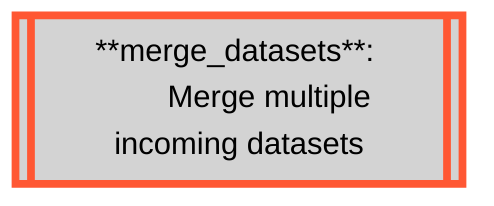
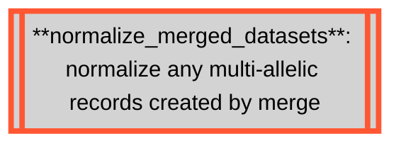
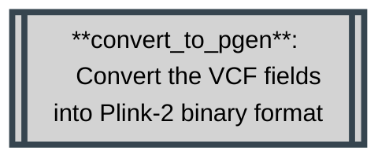

# Methodology
{: .no_toc }

An in-depth overview of each step in the workflow.
{: .fs-6 .fw-300 }

Plink-2
{: .label }

BcfTools
{: .label }

Piccard
{: .label }


<details markdown="block">
  <summary>
    Table of contents
  </summary>
  {: .text-delta }
1. TOC
{:toc}
</details>

---

<details open markdown="block">
  <summary>
    Rule Map/Diagram
  </summary>
  {: .text-delta }

  ```mermaid
---
title: Pharmacogenetics Analysis
---
flowchart TD
  subgraph pharmacogeneticsWorkflow [Pharmacogenetics Workflow]
      direction BT

      classDef bcftools stroke:#FF5733,fill:#D3D3D3,stroke-width:4px,color:black;
      classDef plink stroke:#36454F,fill:#D3D3D3,stroke-width:4px,color:black;
      classDef python stroke:#FEBE10,fill:#D3D3D3,stroke-width:4px,color:black;
      classDef admixture stroke:#333,fill:#D3D3D3,stroke-width:4px,color:black;
      classDef tabix stroke:#023020,fill:#D3D3D3,stroke-width:4px,color:black;
      classDef gatk stroke:#007FFF,fill:#D3D3D3,stroke-width:4px,color:black;
      classDef workflow stroke:#fff,fill:#000000,stroke-width:4px,color:white;

      format_sample_metadata[[format_sample_metadata:
  Transpile cluster ownership from
  sample cluster assignment into
  input format]]

      convert_to_pgen[[**convert_to_pgen**: 
  Convert the VCF fields into Plink-2 binary format]]
      remove_unknown_samples[[**remove_unknown_samples**:
  Subset samples to labeled
  samples in metadata files]]
      
      verify_records_against_reference_genome[[**verify_records_against_reference_genome**:
  Check reference alleles against
  provided reference genome]]
      
      filter_variant_missingness[[**filter_variant_missingness**:
  Filter variants with 100%
  missingness]]
      
      filter_sample_missingness[[**filter_sample_missingness**:
  Filter samples with 100%
  missingness]]

      remove_non_standard_chromosomes[[**remove_non_standard_chromosomes**:
  Filter out non-standard
  chromosomes]]

      calculate_sample_relatedness[[**calculate_sample_relatedness**:
  Calculate relatedness]]

      remove_related_samples[[**remove_related_samples**:
  remove a given list of]]

      extract_provided_coordinates[[**extract_provided_coordinates**:
  Trim the dataset to one of
  the studied regions]]

      report_count_partitioned_per_cluster[[**report_count_partitioned_per_cluster**:
  Perform frequency analysis across each cluster]]

      report_hardy_weinberg_per_cluster[[**report_hardy_weinberg_per_cluster**: Perform HWE analysis across each cluster]]

      report_missingness_per_cluster[[**report_missingness_per_cluster**: Report the missingness rates observed across each cluster]]

      collect_variant_frequency[[**collect_variant_frequency**: Collect cluster-level variant frequency reports into one]]

      report_fishers_exact_with_corrections[[**report_fishers_exact_with_corrections**: Perform Fishers-Exact test with Bonferonni correction]]

      collect_autosomal_hardy_weinberg[[**collect_autosomal_hardy_weinberg**: Collect the HWE reports for autosomal locations]]

      collect_variant_missingness[[**collect_variant_missingness**: Collect all per-cluster variant missingness reports into one]]

      collect_variant_count[[**collect_variant_count**: Collect all per-cluster variant count reports into one]]

      query_variant_effect_predictions[[**query_variant_effect_predictions**: Perform API calls to E! Ensemble REST API to identify variants]]

      compile_variant_effect_predictions[[**compile_variant_effect_predictions**: Collect the RAW API payloads and extract relevant metrics]]

      consolidate_reports[[**consolidate_reports**: Consolidate all the generated reports into one]]

      class format_sample_metadata,query_variant_effect_predictions,compile_variant_effect_predictions,collect_autosomal_hardy_weinberg,collect_variant_count,collect_variant_frequency,collect_variant_missingness,report_fishers_exact_with_corrections,consolidate_reports python;

      class convert_to_pgen,verify_records_against_reference_genome,filter_variant_missingness,filter_sample_missingness,remove_non_standard_chromosomes,remove_unknown_samples,calculate_sample_relatedness,remove_related_samples,extract_provided_coordinates,report_count_partitioned_per_cluster,report_hardy_weinberg_per_cluster,report_missingness_per_cluster plink;

      subgraph multipleVcfProtocol [Multiple dataset protocol]
          direction LR
          multipleVcfProtocolStart(((Start)))
          ifMergeRequired{Is a 
  merge needed?}
          merge_datasets[[**merge_datasets**: 
  Merge multiple incoming datasets]]

          normalize_merged_datasets[[**normalize_merged_datasets**: normalize any multi-allelic records created by merge]]
          multipleVcfProtocolEnd(((End)))

          class merge_datasets,normalize_merged_datasets bcftools;
          multipleVcfProtocolStart --> ifMergeRequired
          ifMergeRequired --> |yes| merge_datasets --> normalize_merged_datasets --> multipleVcfProtocolEnd
          ifMergeRequired --> |No| multipleVcfProtocolEnd
      end

      remove_related_samples --> extract_provided_coordinates
      format_sample_metadata --> extract_provided_coordinates 
      
      
      multipleVcfProtocol --> convert_to_pgen
      format_sample_metadata --> convert_to_pgen
      convert_to_pgen --> verify_records_against_reference_genome
      verify_records_against_reference_genome --> remove_non_standard_chromosomes
      remove_non_standard_chromosomes --> remove_unknown_samples
      remove_unknown_samples --> filter_variant_missingness
      filter_variant_missingness --> filter_sample_missingness
      

      filter_sample_missingness --> calculate_sample_relatedness --> remove_related_samples
      filter_sample_missingness --> remove_related_samples


      extract_provided_coordinates --> report_count_partitioned_per_cluster & report_hardy_weinberg_per_cluster & report_missingness_per_cluster & report_fishers_exact_with_corrections & query_variant_effect_predictions

      query_variant_effect_predictions --> compile_variant_effect_predictions

      extract_provided_coordinates & report_hardy_weinberg_per_cluster --> collect_autosomal_hardy_weinberg
      
      extract_provided_coordinates & report_missingness_per_cluster --> collect_variant_missingness
      
      extract_provided_coordinates & report_count_partitioned_per_cluster --> collect_variant_frequency

      report_count_partitioned_per_cluster --> collect_variant_count

      

      extract_provided_coordinates & collect_variant_frequency & collect_variant_count & collect_autosomal_hardy_weinberg & collect_variant_missingness & compile_variant_effect_predictions --> consolidate_reports

      report_fishers_exact_with_corrections --> consolidate_reports


      
      


  end

  ValidateVcfWorkflow[\Validate VCF Workflow/]

  PopulationStructureWorkflow[\Population Structure Workflow/]
  class PopulationStructureWorkflow,ValidateVcfWorkflow workflow;

  remove_related_samples --> PopulationStructureWorkflow

  ValidateVcfWorkflow --> multipleVcfProtocol

  END((Results))

  consolidate_reports --> END

  PopulationStructureWorkflow --> END
  ```

</details>

#### VCF Validation Workflow Rules

<details markdown="block">
  <summary>
    <code>clear_annotations</code>
  </summary>
  
  ```mermaid
  flowchart TD
  
    clear_annotations[["`**clear_annotations**:
    Remove INFO column for
    computational processing
    efficiency`"]]
  
    classDef bcftools stroke:#FF5733,fill:#D3D3D3,stroke-width:4px,color:black;
    class clear_annotations bcftools;
  ```

  <dl>
    <dt>Function</dt>
    <dd>To remove the <code>INFO</code> and <code>FORMAT</code> columns on the incoming dataset. This is done to speed up computation time for downstream analysis.</dd>
    <dt>Command</dt>
    <dd><code>bcftools annotate -x INFO,FORMAT -Oz -o {output.vcf} {input.vcf}</code></dd>
    <dt>Parameters</dt>
    <dd>
      <dl>
        <dt><code>-x INFO,FORMAT</code></dt>
        <dd>Remove the <code>INFO</code> and <code>FORMAT</code> annotations from the input VCF file.</dd>
        <dt><code>-Oz</code></dt>
        <dd>Output format (<code>-Oz</code> denotes a BG-Zipped VCF output)</dd>
        <dt><code>-o {output.vcf}</code></dt>
        <dd>Output file.</dd>
      </dl>
    </dd>
  </dl>

</details>

<details markdown="block">
  <summary>
    <code>normalize_variant_records</code>
  </summary>
  
  ```mermaid
  flowchart TD
    normalize_variant_records[["`**normalize_variant_records**:
    Normalize all SNPs`"]]

    classDef bcftools stroke:#FF5733,fill:#D3D3D3,stroke-width:4px,color:black;
    class normalize_variant_records bcftools;
  ```

  <dl>
    <dt>Function</dt>
    <dd>
    To normalize variant representations within the dataset provided. This involves the following:
      <ul>
      <li>decomposing multi-allelic records</li>
      <li>left-aligning all variants</li>
      <li>right-handed trimming to ensure parsimony</li>
      </ul>
    </dd>
    <dt>Command</dt>
    <dd><code>bcftools norm -m -any -O z -o {output.vcf} < {input.vcf}</code></dd>
    <dt>Parameters</dt>
    <dd>
      <dl>
        <dt><code>-m -any</code></dt>
        <dd>Decompose multi-allelic entries to bi-allelic entries (<code>-</code>) and merge both SNPs and INDELS into single records (<code>any</code>)</dd>
        <dt><code>-Oz</code></dt>
        <dd>Output format (<code>-Oz</code> denotes a BG-Zipped VCF output)</dd>
        <dt><code>-o {output.vcf}</code></dt>
        <dd>Output file.</dd>
      </dl>
    </dd>
  </dl>

</details>

<details markdown="block">
  <summary>
    <code>filter_variant_types</code>
  </summary>
  
  ```mermaid
  flowchart TD
    filter_variant_types[["`**filter_variant_types**:
    Remove all variant types
    except SNPs`"]]
    
    classDef bcftools stroke:#FF5733,fill:#D3D3D3,stroke-width:4px,color:black;
    class filter_variant_types bcftools;
  ```

  <dl>
      <dt>Function</dt>
      <dd>
      To remove all variant types except SNPs</dd>
      <dt>Command</dt>
      <dd><code>bcftools view -v snps -f PASS -O z -o {output.vcf} < {input.vcf}</code></dd>
      <dt>Parameters</dt>
      <dd>
        <dl>
          <dt><code>-v snps</code></dt>
          <dd>Only include SNPs</dd>
          <dt><code>-f PASS</code></dt>
          <dd>Only select variants with <code>PASS</code> values.</dd>
          <dt><code>-Oz</code></dt>
          <dd>Output format (<code>-Oz</code> denotes a BG-Zipped VCF output)</dd>
          <dt><code>-o {output.vcf}</code></dt>
          <dd>Output file.</dd>
        </dl>
      </dd>
    </dl>

</details>
  
<details markdown="block">
  <summary>
    <code>sort_variant_records</code>
  </summary>
  
  ```mermaid
  flowchart TD
    sort_variant_records[["`**sort_variant_records**:
    Ensure correct variant order`"]]
    
    classDef bcftools stroke:#FF5733,fill:#D3D3D3,stroke-width:4px,color:black;
    class sort_variant_records bcftools;
  ```

  This rule is responsible for sorting variants according to position, relative to the provided reference genome. This is important for downstream analysis which assumes ordered variants.

  <dl>
      <dt>Function</dt>
      <dd>
      To sort variants according to position, relative to the provided reference genome. This is important for downstream analysis which assumes ordered variants.</dd>
      <dt>Command</dt>
      <dd><code>bcftools sort -m {params.memory} -T {params.tmp} -O z -o {output.vcf} < {input.vcf}</code></dd>
      <dt>Parameters</dt>
      <dd>
        <dl>
          <dt><code>-m {params.memory} </code></dt>
          <dd>Provide a RAM memory available to the <code>bcftools sort</code> command.</dd>
          <dt><code>-T {params.tmp}</code></dt>
          <dd>Provide a location where `bcftools` can make a temporary folder to work from.</dd>
          <dt><code>-Oz</code></dt>
          <dd>Output format (<code>-Oz</code> denotes a BG-Zipped VCF output)</dd>
          <dt><code>-o {output.vcf}</code></dt>
          <dd>Output file.</dd>
        </dl>
      </dd>
    </dl>
    
</details>
  
<!-- 
<details markdown="block">
  <summary>
    <code>annotate</code>
  </summary>
  
  ```mermaid
  flowchart TD
    annotate[[annotate:
Annotate VCF against given
reference VCF such as 
 dbSNP, and rename any unknown
variants.]]
  ```

  <dl>
      <dt>Function</dt>
      <dd>
      To annotate the incoming data with variant IDs from the provided <code>resources/annotations.vcf.gz</code>, and rename any unknown variants.</dd>
      <dt>Command</dt>
      <dd><code>bcftools annotate -c ID -a {input.annotations} -O z -o {output.vcf} {input.vcf}</code></dd>
      <dt>Parameters</dt>
      <dd>
        <dl>
          <dt><code>-a {input.annotations}</code></dt>
          <dd>The VCF file that contains the desired annotations.</dd>
          <dt><code>-c ID</code></dt>
          <dd>Copy the <code>ID</code> column from the provided annotation VCF.</dd>
          <dt><code>-I +'%CHROM:%POS|%REF-%FIRST_ALT'</code></dt>
          <dd>Name all variants using the provided formula. The <code>+</code> indicates that this renaming logic should only be applied to variants which have no name, and is applied after retrieving annotations from the provided annotations VCF. <code>%CHROM</code> denotes the chromosome, <code>%POS</code> denotes the base-pair position of this variant, <code>%REF</code> denotes the reference allele at this location, and <code>%FIRST_ALT</code> denotes the first allele. Since this VCF file has been normalized and multi-allelic variants have already been decomposed to bi-allelic records, this will correspond to the only available allele for a loci.</dd>
          <dt><code>-O z</code></dt>
          <dd>Output format (<code>-Oz</code> denotes a BG-Zipped VCF output)</dd>
          <dt><code>-o {output.vcf}</code></dt>
          <dd>Output file.</dd>
        </dl>
      </dd>
    </dl>

</details> -->
<!-- 
<details markdown="block">
  <summary>
    <code>annotateUnknown</code>
  </summary>
  
  ```mermaid
  flowchart TD
    annotateUnknown[[annotateUnknown:
Name all un-annotated variants using 
standardized naming conventions.]]
  ```

  <dl>
      <dt>Function</dt>
      <dd>
      To name all un-named variants which did not have a matching annotation ID.</dd>
      <dt>Command</dt>
      <dd><code>plink --vcf {input.vcf} --set-missing-var-ids @:#\$1-\$2 --new-id-max-allele-len 200 --out {params.output}</code></dd>
      <dt>Parameters</dt>
      <dd>
        <dl>
          <dt><code>--vcf {input.vcf}</code></dt>
          <dd>File path to the input VCF file via parameter.</dd>
          <dt><code>--set-missing-var-ids @:#\$1-\$2</code></dt>
          <dd>A string which describes a naming scheme to be used when setting all un-named variants <code>@</code> denotes the chromosome code, <code>#</code> denotes the base-pair coordinates, <code>$1</code> denotes the reference allele and <code>$2</code> denotes the alternate allele.</dd>
          <dt><code>--new-id-max-allele-len 200</code></dt>
          <dd>Sets a maximum allowed variant ID length.</dd>
          <dt><code>--out {params.output}</code></dt>
          <dd>Provide the file name and path for output creation.</dd>
        </dl>
      </dd>
    </dl>

</details> -->
  

#### Pharmacogenetics Workflow Rules

<details markdown="block">
  <summary>
    <code>format_sample_metadata</code>
  </summary>
  
  ```mermaid
  flowchart TD
    format_sample_metadata[["`**format_sample_metadata**:
    `"]]
    classDef python stroke:#FEBE10,fill:#D3D3D3,stroke-width:4px,color:black;
    class format_sample_metadata python;
  ```

A python script which uses Pandas to convert the provided `samples.csv` into a format suitable for Plink-2.

</details>

<details markdown="block">
  <summary>
    <code>merge_datasets</code>*
  </summary>
  
  ```mermaid
  flowchart TD
    subgraph multipleVcfProtocol [Multiple dataset protocol]
      direction LR
      
        classDef bcftools stroke:#FF5733,fill:#D3D3D3,stroke-width:4px,color:black;
        multipleVcfProtocolStart(((Start)))
        ifMergeRequired{Is a 
merge needed?}
        merge_datasets[[**merge_datasets**: 
        Merge multiple incoming datasets]]

        normalize_merged_datasets[[**normalize_merged_datasets**: normalize any multi-allelic records created by merge]]
        multipleVcfProtocolEnd(((End)))

        class merge_datasets,normalize_merged_datasets bcftools;
        multipleVcfProtocolStart --> ifMergeRequired
        ifMergeRequired --> |yes| merge_datasets --> normalize_merged_datasets --> multipleVcfProtocolEnd
        ifMergeRequired --> |No| multipleVcfProtocolEnd
    end
  ```

  {: .normal }
  > The merge rule is protected by a decision tree and only executes when multiple described datasets are detected. This rule is responsible for merging multiple datasets into a single VCF file, suitable for collective analysis.


  <details markdown="block">
    <summary><code>merge_datasets</code</summary>



<dl>
    <dt>Function</dt>
    <dd>To perform reference-genome version liftovers.</dd>
    <dt>Command</dt>
    <dd><code>bcftools merge -O z -o {output} {input.vcf}</code></dd>
    <dt>Parameters</dt>
    <dd>
        <dl>
        <dt><code>-O z</code></dt>
        <dd>Output format (<code>-Oz</code> denotes a BG-Zipped VCF output)</dd>
        <dt><code>-o {output.vcf}</code></dt>
        <dd>Output file.</dd>
        </dl>
    </dd>
</dl>
  </details>

    <details markdown="block">
    <summary><code>merge_datasets</code</summary>



<dl>
    <dt>Function</dt>
    <dd>To normalize any multi-allelic records which may arise as a result of the merge.</dd>
    <dt>Command</dt>
    <dd><code>bcftools norm --multiallelics - -any -Oz -o {output} {input}</code></dd>
    <dt>Parameters</dt>
    <dd>
        <dl>
        <dt><code>--multiallelics -</code></dt>
        <dd>Split multi-allelic records into bi-allelic records.</dd>
        <dt><code>-O z</code></dt>
        <dd>Output format (<code>-Oz</code> denotes a BG-Zipped VCF output).</dd>
        <dt><code>-o {output.vcf}</code></dt>
        <dd>Output file.</dd>
        </dl>
    </dd>
</dl>
  </details>
</details>


<details markdown="block">
    <summary>
        <code>convert_to_pgen</code>
    </summary>



<dl>
    <dt>Function</dt>
    <dd>To convert text-based VCF files into binary Plink-2 PGEN format which is much more performant.</dd>
    <dt>command</dt>
    <dd><code>plink2 --threads {threads} --vcf {input.vcf} --update-sex {input.sample_metadata} --split-par hg38 --allow-extra-chr --make-pgen vzs --out {params.output}</code></dd>
    <dt>Parameters</dt>
    <dd>
        <dl>
            <dt><code>--threads {threads}</code></dt>
            <dd>Used to set the number of CPU threads used during this calculation</dd>
            <dt><code>--vcf {input.vcf}</code></dt>
            <dd>Used to provide the location of the input file plink needs to work on.</dd>
            <dt><code>--update-sex {input.sample_metadata}</code></dt>
            <dd>Used to provide plink with sample annotations for downstream processing and use.</dd>
            <dt><code>--split-par hg38</code></dt>
            <dd>Used to indicate to plink to use standard coordinates for build hg38 when trimming off the PAR regions on chromosome X.</dd>
            <dt><code>--allow-extra-chr</code></dt>
            <dd>Used to indicate to Plink to expect non-standard chromosomes.</dd>
            <dt><code>--make-pgen vzs</code></dt>
            <dd>Used to indicate that output should be compiled in Plink-2 binary format (.pvar, .pgen and .psam files).</dd>
            <dt><code>--out {params.output}</code></dt>
            <dd>Used to declare the output location that should be used to create the file. File is specified without extension, which is added by Plink.</dd>
        </dl>
    </dd>
</dl>

</details>


<details markdown="block">
  <summary>
    <code>verify_records_against_reference_genome</code>
  </summary>
  
  ```mermaid
  flowchart TD
    classDef plink stroke:#36454F,fill:#D3D3D3,stroke-width:4px,color:black;

    verify_records_against_reference_genome[[verify_records_against_reference_genome:
Check reference alleles against
provided reference genome]]

    class verify_records_against_reference_genome plink;
  ```

 <dl>
      <dt>Function</dt>
      <dd>
      To check each loci and comparing its listed reference to that provided in the reference genome.</dd>
      <dt>Command</dt>
      <dd><code>plink2 --threads {threads} --pfile {params.input} vzs --fa {params.ref} --ref-from-fa force --allow-extra-chr --make-pgen vzs --out {params.output}</code></dd>
      <dt>Parameters</dt>
      <dd>
        <dl>
          <dt><code>--threads {threads}</code></dt>
          <dd>Used to set the number of CPU threads used during this calculation</dd>
          <dt><code>--pfile {params.input} vzs</code></dt>
          <dd>Used to provide plink with the location of a plink-2 binary file set (.psam, .pvar and .pgen files), and to expect z-compressed files.</dd>
          <dt><code>--fa {params.ref}</code></dt>
          <dd>File path to reference genome to be used for comparison.</dd>
          <dt><code>--ref-from-fa force</code></dt>
          <dd>Sets REF allele to provided reference FASTA when possible unambiguously (Does not apply to some INDELS)</dd>
          <dt><code>--threads {threads}</code></dt>
          <dd>Used to set the number of CPU threads used during this calculation</dd>
          <dt><code>--pfile {params.input} vzs</code></dt>
          <dd>Used to provide plink with the location of a plink-2 binary file set (.psam, .pvar and .pgen files), and to expect z-compressed files.</dd>
          <dt><code>--make-pgen zs</code></dt>
          <dd>Save output to a BG-Zipped pgen binary fileset.</dd>
          <dt><code>--out {params.output}</code></dt>
          <dd>Provide the file name and path for output creation.</dd>
        </dl>
      </dd>
    </dl>

</details>

<details markdown="block">
  <summary>
    <code>remove_non_standard_chromosomes</code>
  </summary>

  ```mermaid
  flowchart TD
    classDef plink stroke:#36454F,fill:#D3D3D3,stroke-width:4px,color:black;

    remove_non_standard_chromosomes[[remove_non_standard_chromosomes:
Filter out non-standard
chromosomes]]
    class remove_non_standard_chromosomes plink;
  ```

 <dl>
      <dt>Function</dt>
      <dd>
      To filter out non-standard chromosomes.</dd>
      <dt>Command</dt>
      <dd><code>plink2 --threads {threads} --pfile {params.input} vzs --allow-extra-chr --output-chr chr26 --chr 1-26 --make-pgen vzs --out {params.output}</code></dd>
      <dt>Parameters</dt>
      <dd>
        <dl>
          <dt><code>--threads {threads}</code></dt>
          <dd>Used to set the number of CPU threads used during this calculation</dd>
          <dt><code>--pfile {params.input} vzs</code></dt>
          <dd>Used to provide plink with the location of a plink-2 binary file set (.psam, .pvar and .pgen files), and to expect z-compressed files.</dd>
          <dt><code>--allow-extra-chr</code></dt>
            <dd>Used to indicate to Plink to expect non-standard chromosomes.</dd>
          <dt><code>--output-chr chr26</code></dt>
          <dd>Sets chromosome code notation in output files to include the 'chr' as a prefix.</dd>
          <dt><code>--chr 1-26</code></dt>
          <dd>Request a subset of chromosomes to be included in the output file.</dd>
          <dt><code>--make-pgen zs</code></dt>
          <dd>Save output to a BG-Zipped pgen binary fileset.</dd>
          <dt><code>--out {params.output}</code></dt>
          <dd>Provide the file name and path for output creation.</dd>
        </dl>
      </dd>
    </dl>

</details>


<details markdown="block">
  <summary>
    <code>remove_unknown_samples</code>
  </summary>

  ```mermaid
  flowchart TD
    classDef plink stroke:#36454F,fill:#D3D3D3,stroke-width:4px,color:black;

    remove_unknown_samples[[**remove_unknown_samples**:
Subset samples to labeled samples in metadata files]]

    class remove_unknown_samples plink;
  ```

 <dl>
      <dt>Function</dt>
      <dd>
      To remove unneeded samples. This is done by comparison against all provided sample annotations in the <code>input/samples.csv</code> metadata file.</dd>
      <dt>Command</dt>
      <dd><code>plink2 --threads {threads} --pfile {params.input} vzs --keep {input.sample_metadata} --make-pgen vzs --out {params.output} >{log} 2>&1
        </code></dd>
      <dt>Parameters</dt>
      <dd>
        <dl>
          <dt><code>--threads {threads}</code></dt>
          <dd>Used to set the number of CPU threads used during this calculation</dd>
          <dt><code>--pfile {params.input} vzs</code></dt>
          <dd>Used to provide plink with the location of a plink-2 binary file set (.psam, .pvar and .pgen files), and to expect z-compressed files.</dd>
          <dt><code>--keep {input.sample_metadata}</code></dt>
          <dd>Keep only samples mentioned by name in provided <code>samples.csv</code></dd>
          <dt><code>--make-pgen zs</code></dt>
          <dd>Save output to a BG-Zipped pgen binary fileset.</dd>
          <dt><code>--out {params.output}</code></dt>
          <dd>Provide the file name and path for output creation.</dd>
        </dl>
      </dd>
    </dl>

</details>

<details markdown="block">
  <summary>
    <code>filter_variant_missingness</code>
  </summary>

  ```mermaid
  flowchart TD
    classDef plink stroke:#36454F,fill:#D3D3D3,stroke-width:4px,color:black;

    filter_variant_missingness[[filter_variant_missingness:
Filter variants with 100% missingness]]
class filter_variant_missingness plink;
  ```

 <dl>
      <dt>Function</dt>
      <dd>
      To manage and remove regions of missing calls along the variant-level.</dd>
      <dt>Command</dt>
      <dd><code>plink2 --threads {threads} --pfile {params.input} vzs  --geno 1.0 --make-pgen vzs --out {params.output}</code></dd>
      <dt>Parameters</dt>
      <dd>
        <dl>
          <dt><code>--threads {threads}</code></dt>
          <dd>Used to set the number of CPU threads used during this calculation</dd>
          <dt><code>--pfile {params.input} vzs</code></dt>
          <dd>Used to provide plink with the location of a plink-2 binary file set (.psam, .pvar and .pgen files), and to expect z-compressed files.</dd>
          <dt><code>--geno 1.0</code></dt>
          <dd>Filters based on 100% variant missingness</dd>
          <dt><code>--make-pgen zs</code></dt>
          <dd>Save output to a BG-Zipped pgen binary fileset.</dd>
          <dt><code>--out {params.output}</code></dt>
          <dd>Output file.</dd>
        </dl>
      </dd>
    </dl>

</details>

<details markdown="block">
  <summary>
    <code>filter_sample_missingness</code>
  </summary>

  ```mermaid
  flowchart TD
    classDef plink stroke:#36454F,fill:#D3D3D3,stroke-width:4px,color:black;

    filter_sample_missingness[[filter_sample_missingness:
Filter samples with 100% missingness]]
    class filter_sample_missingness plink;
  ```

 <dl>
      <dt>Function</dt>
      <dd>
      To manage and remove regions of missing calls along the sample-level.</dd>
      <dt>Command</dt>
      <dd><code>plink2 --threads {threads} --pfile {params.input} vzs --mind 1.0 --make-pgen vzs --out {params.output}</code></dd>
      <dt>Parameters</dt>
      <dd>
        <dl>
          <dt><code>--threads {threads}</code></dt>
          <dd>Used to set the number of CPU threads used during this calculation</dd>
          <dt><code>--pfile {params.input} vzs</code></dt>
          <dd>Used to provide plink with the location of a plink-2 binary file set (.psam, .pvar and .pgen files), and to expect z-compressed files.</dd>
          <dt><code>--mind 1.0</code></dt>
          <dd>Filters out samples with more than 100% missingness</dd>
          <dt><code>--make-pgen zs</code></dt>
          <dd>Save output to a BG-Zipped pgen binary fileset.</dd>
          <dt><code>--out {params.output}</code></dt>
          <dd>Provide the file name and path for output creation.</dd>
        </dl>
      </dd>
    </dl>

</details>

<details markdown="block">
  <summary>
    <code>calculate_sample_relatedness</code>
  </summary>

  ```mermaid
  flowchart TD
    classDef plink stroke:#36454F,fill:#D3D3D3,stroke-width:4px,color:black;

    calculate_sample_relatedness[[calculate_sample_relatedness:
Calculate Identity-By-Descent]]
    class calculate_sample_relatedness plink;
  ```

 <dl>
      <dt>Function</dt>
      <dd>
      To calculate sample relatedness using a kingship estimator provided by Plink-2.</dd>
      <dt>Command</dt>
      <dd><code>plink2 --threads {threads} --pfile {params.input} vzs --king-cutoff 0.354 --out {params.output}</code></dd>
      <dt>Parameters</dt>
      <dd>
        <dl>
          <dt><code>--threads {threads}</code></dt>
          <dd>Used to set the number of CPU threads used during this calculation</dd>
          <dt><code>--pfile {params.input} vzs</code></dt>
          <dd>Used to provide plink with the location of a plink-2 binary file set (.psam, .pvar and .pgen files), and to expect z-compressed files.</dd>
          <dt><code>--king-cutoff 0.354</code></dt>
          <dd>Filters out samples which show a kingship estimator of greater than 0.354.</dd>
          <dt><code>--out {params.output}</code></dt>
          <dd>Provide the file name and path for output creation.</dd>
        </dl>
      </dd>
    </dl>

</details>

<details markdown="block">
  <summary>
    <code>remove_related_samples</code>
  </summary>

  ```mermaid
  flowchart TD
    classDef plink stroke:#36454F,fill:#D3D3D3,stroke-width:4px,color:black;

    remove_related_samples[[remove_related_samples:
remove a given list of samples
based on IBD results]]
    class remove_related_samples plink;
  ```

 <dl>
      <dt>Function</dt>
      <dd>
      To filter out all but unrelated samples, given the list of samples to keep from its predecessor rules.</dd>
      <dt>Command</dt>
      <dd><code>plink2 --threads {threads} --pfile {params.input} vzs --keep {input.unrelated_samples} --make-pgen vzs --out {params.output}</code></dd>
      <dt>Parameters</dt>
      <dd>
        <dl>
          <dt><code>--threads {threads}</code></dt>
          <dd>Used to set the number of CPU threads used during this calculation</dd>
          <dt><code>--pfile {params.input} vzs</code></dt>
          <dd>Used to provide plink with the location of a plink-2 binary file set (.psam, .pvar and .pgen files), and to expect z-compressed files.</dd>
          <dt><code>--keep {input.sample_metadata}</code></dt>
          <dd>Keep only samples mentioned by name in provided <code>samples.csv</code></dd>
          <dt><code>--make-pgen zs</code></dt>
          <dd>Save output to a BG-Zipped pgen binary fileset.</dd>
          <dt><code>--out {params.output}</code></dt>
          <dd>Provide the file name and path for output creation.</dd>
        </dl>
      </dd>
    </dl>

</details>

<details markdown="block">
  <summary>
    <code>extract_provided_coordinates</code>
  </summary>

  ```mermaid
  flowchart TD
    classDef plink stroke:#36454F,fill:#D3D3D3,stroke-width:4px,color:black;

    extract_provided_coordinates[[extract_provided_coordinates:
Trim the dataset to one of
the studied regions]]

    class extract_provided_coordinates plink;
  ```

 <dl>
      <dt>Function</dt>
      <dd>
      To filter out all but unrelated samples, given the list of samples to keep from its predecessor rules.</dd>
      <dt>Command</dt>
      <dd><code>plink2 --threads {threads} --pfile {params.input} vzs --from-bp {params.fromBP} --to-bp {params.toBP} --chr {params.chr} --make-pgen vzs --out {params.output}</code></dd>
      <dt>Parameters</dt>
      <dd>
        <dl>
          <dt><code>--threads {threads}</code></dt>
          <dd>Used to set the number of CPU threads used during this calculation</dd>
          <dt><code>--pfile {params.input} vzs</code></dt>
          <dd>Used to provide plink with the location of a plink-2 binary file set (.psam, .pvar and .pgen files), and to expect z-compressed files.</dd>
          <dt><code>--from-bp</code></dt>
          <dd>The start co-ordinates to start trimming from.</dd>
          <dt><code>--to-bp</code></dt>
          <dd>The stop coordinates to trim until.</dd>
          <dt><code>--chr</code></dt>
          <dd>The chromosome on which the coordinates can be found.</dd>
          <dt><code>--make-pgen zs</code></dt>
          <dd>Save output to a BG-Zipped pgen binary fileset.</dd>
          <dt><code>--out {params.output}</code></dt>
          <dd>Provide the file name and path for output creation.</dd>
        </dl>
      </dd>
    </dl>

</details>


<details markdown="block">
  <summary>
    <code>report_count_partitioned_per_cluster</code>
  </summary>

  ```mermaid
  flowchart TD
    classDef plink stroke:#36454F,fill:#D3D3D3,stroke-width:4px,color:black;
    
    report_count_partitioned_per_cluster[[**report_count_partitioned_per_cluster**:
Perform frequency analysis]]
    class report_count_partitioned_per_cluster plink;
  ```

  <dl>
      <dt>Function</dt>
      <dd>
      To generate a frequency report.</dd>
      <dt>Command</dt>
      <dd><code>plink2 --threads {threads} --pfile {params.input} vzs --loop-cats {wildcards.cluster} --freq counts cols=chrom,pos,ref,alt,reffreq,altfreq,nobs --out {params.output}</code></dd>
      <dt>Parameters</dt>
      <dd>
        <dl>
            <dt><code>--threads {threads}</code></dt>
          <dd>Used to set the number of CPU threads used during this calculation</dd>
          <dt><code>--pfile {params.input} vzs</code></dt>
          <dd>Used to provide plink with the location of a plink-2 binary file set (.psam, .pvar and .pgen files), and to expect z-compressed files.</dd>
          <dt><code>--loop-cats {wildcards.cluster}</code></dt>
          <dd>Perform the requested computation repeAtedly, sampeling across the provided clusters, as assigned via the provided <code>samples.csv</code></dd>
          <dt><code>--freq counts cols=chrom,pos,ref,alt,reffreq,altfreq,nobs</code></dt>
          <dd>Calculate the frequency of each variant record. Include the following columns:
            <ul>
                <li>Chromosome</li>
                <li>Position</li>
                <li>Reference Allele</li>
                <li>Alternate allele</li>
                <li>Reference allele frequency</li>
                <li>Alternate allele frequency</li>
                <li>Number of observations</li>
            </ul>
          </dd>
          <dt><code>--out {params.output}</code></dt>
          <dd>Provide the file name and path for output creation.</dd>  
        </dl>
      </dd>
    </dl>

</details>

<details markdown="block">
  <summary>
    <code>report_hardy_weinberg_per_cluster</code>
  </summary>

  ```mermaid
  flowchart TD
    classDef plink stroke:#36454F,fill:#D3D3D3,stroke-width:4px,color:black;

    report_hardy_weinberg_per_cluster[[**report_hardy_weinberg_per_cluster**:
Perform Hardy-Weinberg analysis]]

    class report_hardy_weinberg_per_cluster plink;
  ```

  <dl>
      <dt>Function</dt>
      <dd>
      To generate a hardy-weinberg report.</dd>
      <dt>Command</dt>
      <dd><code>plink2 --threads {threads} --pfile {params.input} vzs --loop-cats {wildcards.cluster} --hardy midp cols=chrom,pos,ref,alt,gcounts,hetfreq,p --out {params.output}</code></dd>
      <dt>Parameters</dt>
      <dd>
        <dl>
          <dt><code>--threads {threads}</code></dt>
          <dd>Used to set the number of CPU threads used during this calculation</dd>
          <dt><code>--pfile {params.input} vzs</code></dt>
          <dd>Used to provide plink with the location of a plink-2 binary file set (.psam, .pvar and .pgen files), and to expect z-compressed files.</dd>
          <dt><code>--loop-cats {wildcards.cluster}</code></dt>
          <dd>Perform the requested computation repeAtedly, sampeling across the provided clusters, as assigned via the provided <code>samples.csv</code></dd>
          <dt><code>--hardy midp cols=chrom,pos,ref,alt,gcounts,hetfreq,p</code></dt>
          <dd>Perform equilibrium, test on each variant record. Include the following columns:
            <ul>
                <li>Chromosome</li>
                <li>Position</li>
                <li>Reference Allele</li>
                <li>Alternate allele</li>
                <li>Genotype counts</li>
                <li>Heterozygote frequency</li>
                <li>P-value</li>
            </ul>
          </dd>
          <dt><code>--out {params.output}</code></dt>
          <dd>Provide the file name and path for output creation.</dd>  
        </dl>
      </dd>
    </dl>

</details>

<details markdown="block">
  <summary>
    <code>report_fixation_index_per_cluster</code>
  </summary>

  ```mermaid
  flowchart TD
    classDef plink stroke:#36454F,fill:#D3D3D3,stroke-width:4px,color:black;

    report_fixation_index_per_cluster[[**report_fixation_index_per_cluster**:
Perform Fixation index calculations]]

    class report_fixation_index_per_cluster plink;
  ```

  <dl>
      <dt>Function</dt>
      <dd>
      To generate a hardy-weinberg report.</dd>
      <dt>Command</dt>
      <dd><code>plink2 --threads {threads} --pfile {params.input} vzs --fst {wildcards.cluster} report-variants zs --out {params.output}</code></dd>
      <dt>Parameters</dt>
      <dd>
        <dl>
          <dt><code>--threads {threads}</code></dt>
          <dd>Used to set the number of CPU threads used during this calculation</dd>
          <dt><code>--pfile {params.input} vzs</code></dt>
          <dd>Used to provide plink with the location of a plink-2 binary file set (.psam, .pvar and .pgen files), and to expect z-compressed files.</dd>
          <dt><code>--fst {wildcards.cluster} report-variants zs</code></dt>
          <dd>Perform the requested fixation index calculations. the <code>report-variants</code> modifier requests variant-level fst results and the <code>zs</code> modifier requests the output to be compressed.</dd>
          <dt><code>--out {params.output}</code></dt>
          <dd>Provide the file name and path for output creation.</dd>  
        </dl>
      </dd>
    </dl>

</details>

<details markdown="block">
  <summary>
    <code>report_missingness_per_cluster</code>
  </summary>

  ```mermaid
  flowchart TD
    classDef plink stroke:#36454F,fill:#D3D3D3,stroke-width:4px,color:black;

    report_missingness_per_cluster[[**report_missingness_per_cluster**:
Perform missingness calculations]]

    class report_missingness_per_cluster plink;
  ```

  <dl>
      <dt>Function</dt>
      <dd>
      To generate a missingness report.</dd>
      <dt>Command</dt>
      <dd><code>plink2 --threads {threads} --pfile {params.input} vzs --loop-cats {wildcards.cluster} --missing zs vcols=chrom,pos,ref,alt,provref,nmiss,nobs,fmiss --out {params.output}</code></dd>
      <dt>Parameters</dt>
      <dd>
        <dl>
          <dt><code>--threads {threads}</code></dt>
          <dd>Used to set the number of CPU threads used during this calculation</dd>
          <dt><code>--pfile {params.input} vzs</code></dt>
          <dd>Used to provide plink with the location of a plink-2 binary file set (.psam, .pvar and .pgen files), and to expect z-compressed files.</dd>
          <dt><code>--loop-cats {wildcards.cluster}</code></dt>
          <dd>Perform the requested computation repeAtedly, sampeling across the provided clusters, as assigned via the provided <code>samples.csv</code></dd>
          <dt><code>--missing zs vcols=chrom,pos,ref,alt,provref,nmiss,nobs,fmiss</code></dt>
          <dd>Perform missingness calculations on each variant record. Include the following columns:
            <ul>
                <li>Chromosome</li>
                <li>Position</li>
                <li>Reference Allele</li>
                <li>Alternate allele</li>
                <li>Provisional Reference</li>
                <li>Number of missing</li>
                <li>Number of observations</li>
                <li>Frequency of missingness</li>
            </ul>
          </dd>
          <dt><code>--out {params.output}</code></dt>
          <dd>Provide the file name and path for output creation.</dd>  
        </dl>
      </dd>
    </dl>

</details>

<details markdown="block">
  <summary>
    <code>collect_variant_count</code>
  </summary>

  ```mermaid
  flowchart TD
    classDef python stroke:#FEBE10,fill:#D3D3D3,stroke-width:4px,color:black;

    collect_variant_count[[**collect_variant_count**:
Collect cluster-level variant count results]]

    class collect_variant_count python;
  ```

  <dl>
      <dt>Function</dt>
      <dd>
      A python script to compile multiple cluster-level variant-count results into a single report.</dd>
    </dl>

</details>

<details markdown="block">
  <summary>
    <code>collect_variant_frequency</code>
  </summary>

  ```mermaid
  flowchart TD
    classDef python stroke:#FEBE10,fill:#D3D3D3,stroke-width:4px,color:black;

    collect_variant_frequency[[**collect_variant_frequency**:
Collect cluster-level variant frequency results]]

    class collect_variant_frequency python;
  ```

  <dl>
      <dt>Function</dt>
      <dd>
      A python script to compile multiple cluster-level variant-frequency results into a single report.</dd>
    </dl>

</details>

<details markdown="block">
  <summary>
    <code>report_fishers_exact_with_corrections</code>
  </summary>

  ```mermaid
  flowchart TD
    classDef python stroke:#FEBE10,fill:#D3D3D3,stroke-width:4px,color:black;

    report_fishers_exact_with_corrections[[**report_fishers_exact_with_corrections**:
Perform Fishers-Exact tests With Bonferonni-correction]]

    class report_fishers_exact_with_corrections python;
  ```

  <dl>
      <dt>Function</dt>
      <dd>
      A python script to perform corrected Fishers-Exact test (Bonferoni method) to identify significant differences in variant frequency between clusters.</dd>
    </dl>

</details>

<details markdown="block">
  <summary>
    <code>collect_autosomal_hardy_weinberg</code>
  </summary>

  ```mermaid
  flowchart TD
    classDef python stroke:#FEBE10,fill:#D3D3D3,stroke-width:4px,color:black;

    collect_autosomal_hardy_weinberg[[**collect_autosomal_hardy_weinberg**:
Collect cluster-level variant count results]]

    class collect_autosomal_hardy_weinberg python;
  ```

  <dl>
      <dt>Function</dt>
      <dd>
      A python script to compile multiple cluster-level autosomal hardy-weinberg results into a single report.</dd>
    </dl>

</details>

<details markdown="block">
  <summary>
    <code>collect_variant_missingness</code>
  </summary>

  ```mermaid
  flowchart TD
    classDef python stroke:#FEBE10,fill:#D3D3D3,stroke-width:4px,color:black;

    collect_variant_missingness[[**collect_variant_missingness**:
Collect cluster-level variant missingness results]]

    class collect_variant_missingness python;
  ```

  <dl>
      <dt>Function</dt>
      <dd>
      A python script to compile multiple cluster-level variant-missingness results into a single report.</dd>
    </dl>

</details>

<details markdown="block">
  <summary>
    <code>query_variant_effect_predictions</code>
  </summary>

  ```mermaid
  flowchart TD
    classDef python stroke:#FEBE10,fill:#D3D3D3,stroke-width:4px,color:black;

    query_variant_effect_predictions[[**query_variant_effect_predictions**:
Perform network calls to retrieve variant annotations]]

    class query_variant_effect_predictions python;
  ```

  <dl>
      <dt>Function</dt>
      <dd>
      A python script to perform batched API calls to the <a href="https://rest.ensembl.org/#VEP">E! Ensembl REST APIs VEP tool</a> to retrieve and store cached variant annotations.</dd>
    </dl>

</details>

<details markdown="block">
  <summary>
    <code>compile_variant_effect_predictions</code>
  </summary>

  ```mermaid
  flowchart TD
    classDef python stroke:#FEBE10,fill:#D3D3D3,stroke-width:4px,color:black;

    compile_variant_effect_predictions[[**compile_variant_effect_predictions**:
Extract relevant metrics from raw annotation responses.]]

    class compile_variant_effect_predictions python;
  ```

  <dl>
      <dt>Function</dt>
      <dd>
      A python script to extract relevant metrics from the returned annotations.</dd>
    </dl>

</details>

<details markdown="block">
  <summary>
    <code>consolidate_reports</code>
  </summary>

  ```mermaid
  flowchart TD
    classDef python stroke:#FEBE10,fill:#D3D3D3,stroke-width:4px,color:black;

    consolidate_reports[[**consolidate_reports**:
Compile reports into a single file]]

    class consolidate_reports python;
  ```

  <dl>
      <dt>Function</dt>
      <dd>
      A python script to collect and compile all output reports into a single output file for review.</dd>
    </dl>

</details>

#### Population Structure Workflow Rules

<details markdown="block">
  <summary>
    <code>plinkPed</code>
  </summary>

  ```mermaid
  flowchart TD
    plinkPed[[plinkPed:
Convert to PLINK-1.9's PED
 format]]
  ```

</details>

<details markdown="block">
  <summary>
    <code>fetchPedLables</code>
  </summary>

  ```mermaid
  flowchart TD
    fetchPedLables[[fetchPedLables:
Generate Ind2Pop sample annotations
 file]]
  ```

</details>

<details markdown="block">
  <summary>
    <code>Admixture</code>
  </summary>

  ```mermaid
  flowchart TD
    Admixture[[Admixture:
Perform an admixture analysis]]
  ```

</details>

<details markdown="block">
  <summary>
    <code>plinkPca</code>
  </summary>

  ```mermaid
  flowchart TD
    plinkPca[[Plink_PCA:
Perform a PLINK-2.0 PCA]]
  ```

</details>
