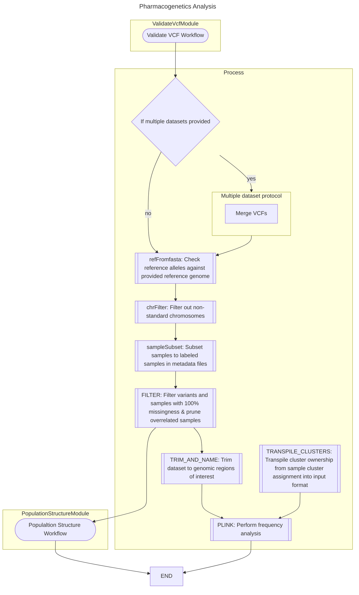
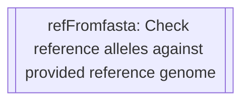
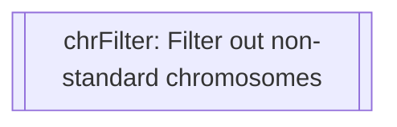
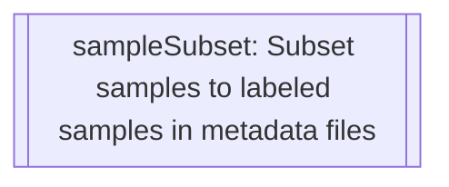
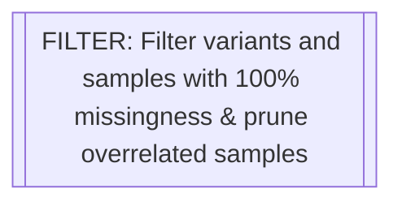
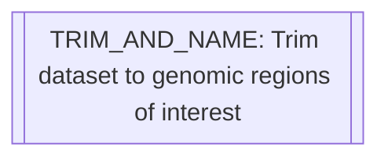
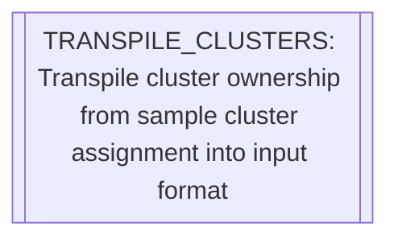
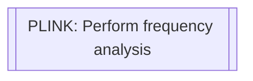

# Configuration
{: .no_toc }

A breakdown of the process used in this workflow and how it has been implemented.
{: .fs-6 .fw-300 }

Reference Genome Configuration
{: .label }

  

    Table of contents
  

  {: .text-delta }
1. TOC
{:toc}

---

## `refFromFasta`

This rule is responsible for checking each loci and comparing its listed reference to that provided in the reference genome.

## `chrFilter`

## `sampleSubset`

## `FILTER`

## `TRIM_AND_NAME`

## `TRANSPILE_CLUSTERS`

## `PLINK`
