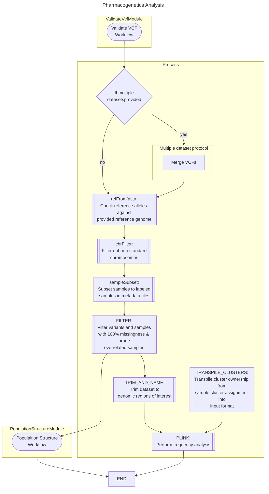
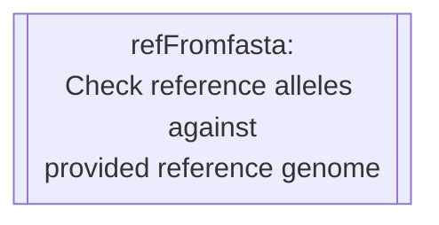
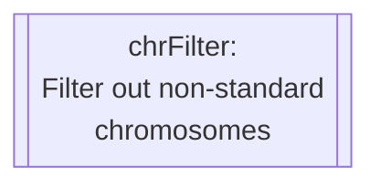
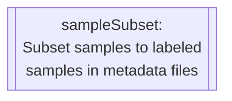
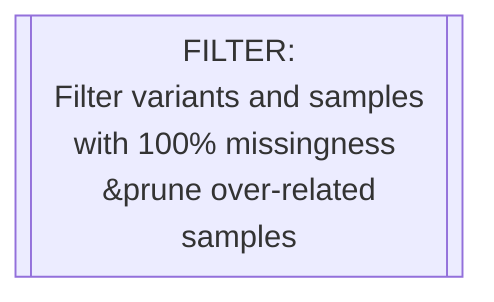
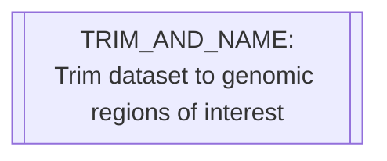
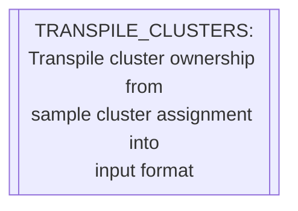
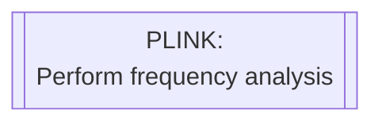

# Configuration
{: .no_toc }

A breakdown of the process used in this workflow and how it has been implemented.
{: .fs-6 .fw-300 }

Reference Genome Configuration
{: .label }

  

    Table of contents
  

  {: .text-delta }
1. TOC
{:toc}

---

#### Rule Reference

  

    <code>refFromFasta</code>
  

  

This rule is responsible for checking each loci and comparing its listed reference to that provided in the reference genome.

  

    <code>chrFilter</code>
  

  

    <code>sampleSubset</code>
  

  

    <code>FILTER</code>
  

  

    <code>TRIM_AND_NAME</code>
  

  

    <code>TRANSPILE_CLUSTERS</code>
  

  

    <code>PLINK</code>
  

