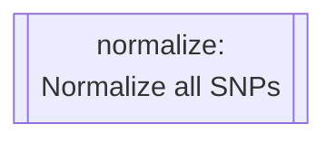

# Configuration
{: .no_toc }

A breakdown of the process used in this workflow and how it has been implemented.
{: .fs-6 .fw-300 }

Reference Genome Configuration
{: .label }


<details markdown="block">
  <summary>
    Table of contents
  </summary>
  {: .text-delta }
1. TOC
{:toc}
</details>

---

<details markdown="block">
  <summary>
    Rule Map/Diagram
  </summary>
  {: .text-delta }

  ```mermaid
  ---
  title: Pharmacogenetics Analysis
  ---
  flowchart TD
subgraph pharmacogeneticsWorkflow [Pharmacogenetics Workflow]
    direction BT

    reportFreq[[reportFreq:\nPerform frequency analysis]]
    filterRequestedSamples[[filterRequestedSamples:\nSubset samples to labeled\nsamples in metadata files]]
    filterVariantMissingness[[filterVariantMissingness:\nFilter variants with 100%\nmissingness]]
    filterSampleMissingness[[filterSampleMissingness:\nFilter samples with 100%\nmissingness]]
    refFromFasta[[refFromfasta:\nCheck reference alleles against\nprovided reference genome]]
    chrFilter[[chrFilter:\nFilter out non-standard\nchromosomes]]
    writeSampleMetadata[[writeSampleMetadata:\nTranspile cluster ownership from\nsample cluster assignment into\ninput format]]
    calculateLinkageDisequilibrium[[calculateLinkageDisequilibrium:\nCalculate LD associations]]
    filterLinkageDisequilibrium[[filterLinkageDisequilibrium:\nRemove variants in LD]]
    calculateIdentityByDescent[[calculateIdentityByDescent:\nCalculate Identity-By-Descent]]
    calculateSampleIds[[calculateSampleIds:\nQuery a list of sample IDs\nfrom the input VCF]]
    filterSampleRelatedness[[filterSampleRelatedness:\nremove a given list of]]
    filterLocations[[filterLocations:\nTrim the dataset to one of\nthe studied regions]]

    ifMultipleVcfs{If multiple\ndatasetsprovided}

    subgraph multipleVcfProtocol [Multiple dataset protocol]
        mergeDatasets[[mergeDatasets:\nMerge multiple incoming\ndatasets]]
    end


    ifMultipleVcfs --> |yes| multipleVcfProtocol
    ifMultipleVcfs --> |no| refFromFasta

    
    multipleVcfProtocol --> refFromFasta --> chrFilter --> filterRequestedSamples --> filterVariantMissingness --> filterSampleMissingness --> calculateLinkageDisequilibrium
    
    calculateLinkageDisequilibrium & filterSampleMissingness --> filterLinkageDisequilibrium

    filterLinkageDisequilibrium --> calculateIdentityByDescent --> calculateSampleIds

    filterLinkageDisequilibrium & calculateSampleIds --> filterSampleRelatedness

    filterSampleRelatedness --> filterLocations --> reportFreq
    
    

    writeSampleMetadata --> reportFreq

end 
subgraph ValidateVcfWorkflow [Validate VCF Workflow]
    wipeInfo[[wipeInfo:\nRemove INFO column for\ncomputational processing\n efficiency]]
    normalize[[normalize:\nNormalize all SNPs]]
    sort[[sort:\nEnsure correct variant order]]
    filter[[filter:\nRemove all variants except\nSNPs and INDELs]]
    annotate[[annotate:\nannotate VCF against given\nreference VCF such as \n dbSNP]]
    liftover[[liftover:\nPerform reference genome\nliftover]]

    wipeInfo --> normalize --> sort --> filter --> annotate --> liftover
end
subgraph PopulationStructureWorkflow [Population Structure Workflow]
    plinkPca[[Plink_PCA:\nPerform a PLINK-2.0 PCA]]
    plinkPed[[plinkPed:\nConvert to PLINK-1.9's PED\n format]]
    fetchPedLables[[fetchPedLables:\nGenerate Ind2Pop sample annotations\n file]]
    Admixture[[Admixture:\nPerform an admixture analysis]]

    plinkPed --> fetchPedLables --> Admixture
    filterSampleRelatedness --> plinkPca & plinkPed

end

liftover --> ifMultipleVcfs


plinkPca --> END
Admixture --> END
reportFreq --> END
  ```

</details>

#### VCF Validation Workflow Rules

<details markdown="block">
  <summary>
    <code>wipeInfo</code>
  </summary>
  
  ```mermaid
  flowchart TD
  wipeInfo[[wipeInfo:\nRemove INFO column for\ncomputational processing\n efficiency]]
  ```

  This rule is responsible for removing the `INFO` and `FORMAT` columns on the incoming dataset. This is done to speed up computation time for downstream analysis. The `bcftools annotate` is used to achieve this.

</details>

<details markdown="block">
  <summary>
    <code>normalize</code>
  </summary>
  


  This rule is responsible for normalizing variant representations. This involves the following:
  - decomposing multi-allelic records
  - left-aligning all variants
  - right-handed trimming to ensure parsimony

</details>
  

<details markdown="block">
  <summary>
    <code>sort</code>
  </summary>
  
  ```mermaid
  flowchart TD
  sort[[sort:\nEnsure correct variant order]]
  ```

  This rule is responsible for sorting variants according to position, relative to the provided reference genome. This is important for downstream analysis which assumes ordered variants.

</details>
  

<details markdown="block">
  <summary>
    <code>filter</code>
  </summary>
  
  ```mermaid
  flowchart TD
  filter[[filter:\nRemove all variants except\nSNPs and INDELs]]
  ```

  This rule is responsible for removing all variant types except SNPs and InDels.

</details>
  

<details markdown="block">
  <summary>
    <code>annotate</code>
  </summary>
  
  ```mermaid
  flowchart TD
  annotate[[annotate:\nannotate VCF against given\nreference VCF such as \n dbSNP]]
  ```

  This rule is responsible for annotating the incoming data with variant IDs from the provided `resources/annotations.vcf.gz`.

</details>
  

<details markdown="block">
  <summary>
    <code>liftover</code>*
  </summary>
  
  ```mermaid
  flowchart TD
  liftover[[liftover:\nPerform reference genome\nliftover]]
  ```

  This rule is responsible for performing reference-genome version liftovers.

</details>

#### Pharmacogenetics Workflow Rules

<details markdown="block">
  <summary>
    <code>mergeDatasets</code>*
  </summary>
  
  ```mermaid
  flowchart TD
  mergeDatasets[[mergeDatasets:\nMerge multiple incoming\ndatasets]]
  ```

  This rule is responsible for merging multiple datasets into a single VCF file, suitable for collective analysis.

  > This rule only executes when multiple described datasets are detected.


</details>


<details markdown="block">
  <summary>
    <code>refFromFasta</code>
  </summary>
  
  ```mermaid
  flowchart TD
  refFromFasta[[refFromfasta:\nCheck reference alleles against\nprovided reference genome]]
  ```

  This rule is responsible for checking each loci and comparing its listed reference to that provided in the reference genome.

</details>

<details markdown="block">
  <summary>
    <code>chrFilter</code>
  </summary>

  ```mermaid
  flowchart TD
  chrFilter[[chrFilter:\nFilter out non-standard\nchromosomes]]
  ```

  This rule is responsible for filtering out non-standard chromosomes.

</details>


<details markdown="block">
  <summary>
    <code>filterRequestedSamples</code>
  </summary>

  ```mermaid
  flowchart TD
  filterRequestedSamples[[filterRequestedSamples:\nSubset samples to labeled\nsamples in metadata files]]
  ```

  This rule is responsible for removing unneeded samples. This is done by comparison against all provided sample annotations in the `input/samples.csv` metadata file.

</details>


<details markdown="block">
  <summary>
    <code>filterVariantMissingness</code>
  </summary>

  ```mermaid
  flowchart TD
  filterVariantMissingness[[filterVariantMissingness:\nFilter variants with 100%\nmissingness]]
  ```

  This rule is responsible for managing and removing regions of missing calls. This filtering is performed across both the variant and sample level.

</details>

<details markdown="block">
  <summary>
    <code>filterSampleMissingness</code>
  </summary>

  ```mermaid
  flowchart TD
  filterSampleMissingness[[filterSampleMissingness:\nFilter samples with 100%\nmissingness]]
  ```

  This rule is responsible for managing and removing regions of missing calls. This filtering is performed across both the variant and sample level.

</details>

<details markdown="block">
  <summary>
    <code>calculateLinkageDisequilibrium</code>
  </summary>

  ```mermaid
  flowchart TD
  calculateLinkageDisequilibrium[[calculateLinkageDisequilibrium:\nCalculate LD associations]]
  ```

  This rule is responsible for calculating and compiling a Linkage-Disequilibrium report

</details>

<details markdown="block">
  <summary>
    <code>filterLinkageDisequilibrium</code>
  </summary>

  ```mermaid
  flowchart TD
  filterLinkageDisequilibrium[[filterLinkageDisequilibrium:\nRemove variants in LD]]
  ```

  This rule is responsible for calculating and compiling a Linkage-Disequilibrium report

</details>

<details markdown="block">
  <summary>
    <code>calculateIdentityByDescent</code>
  </summary>

  ```mermaid
  flowchart TD
  calculateIdentityByDescent[[calculateIdentityByDescent:\nCalculate Identity-By-Descent]]
  ```

  This rule is responsible for calculating and compiling a Linkage-Disequilibrium report

</details>

<details markdown="block">
  <summary>
    <code>calculateSampleIds</code>
  </summary>

  ```mermaid
  flowchart TD
  calculateSampleIds[[calculateSampleIds:\nQuery a list of sample IDs\nfrom the input VCF]]
  ```

  This rule is responsible for calculating and compiling a Linkage-Disequilibrium report

</details>

<details markdown="block">
  <summary>
    <code>filterSampleRelatedness</code>
  </summary>

  ```mermaid
  flowchart TD
  filterSampleRelatedness[[filterSampleRelatedness:\nremove a given list of]]
  ```

  This rule is responsible for filtering out all but unrelated samples, given the list of samples to keep from its predecessor rules.

</details>

<details markdown="block">
  <summary>
    <code>filterLocations</code>
  </summary>

  ```mermaid
  flowchart TD
  filterLocations[[filterLocations:\nTrim the dataset to one of\nthe studied regions]]
  ```

</details>

<details markdown="block">
  <summary>
    <code>filterLocations</code>
  </summary>

  ```mermaid
  flowchart TD
  filterLocations[[filterLocations:\nTrim the dataset to one of\nthe studied regions]]
  ```

  This rule is responsible for trimming the input data down to regions of interest for expedited, targeted analysis.

</details>

<details markdown="block">
  <summary>
    <code>TRANSPILE_writeSampleMetadataCLUSTERS</code>
  </summary>

  ```mermaid
  flowchart TD
  writeSampleMetadata[[writeSampleMetadata:\nTranspile cluster ownership from\nsample cluster assignment into\ninput format]]
  ```

  This rule is responsible for converting 

</details>

<details markdown="block">
  <summary>
    <code>reportFreq</code>
  </summary>

  ```mermaid
  flowchart TD
  reportFreq[[reportFreq:\nPerform frequency analysis]]
  ```

</details>

#### Population Structure Workflow Rules

<details markdown="block">
  <summary>
    <code>plinkPed</code>
  </summary>

  ```mermaid
  flowchart TD
  plinkPed[[plinkPed:\nConvert to PLINK-1.9's PED\n format]]
  ```

</details>

<details markdown="block">
  <summary>
    <code>fetchPedLables</code>
  </summary>

  ```mermaid
  flowchart TD
  fetchPedLables[[fetchPedLables:\nGenerate Ind2Pop sample annotations\n file]]
  ```

</details>

<details markdown="block">
  <summary>
    <code>Admixture</code>
  </summary>

  ```mermaid
  flowchart TD
  Admixture[[Admixture:\nPerform an admixture analysis]]
  ```

</details>

<details markdown="block">
  <summary>
    <code>plinkPca</code>
  </summary>

  ```mermaid
  flowchart TD
  plinkPca[[Plink_PCA:\nPerform a PLINK-2.0 PCA]]
  ```

</details>

