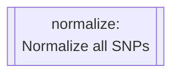

# Configuration
{: .no_toc }

A breakdown of the process used in this workflow and how it has been implemented.
{: .fs-6 .fw-300 }

Reference Genome Configuration
{: .label }


<details markdown="block">
  <summary>
    Table of contents
  </summary>
  {: .text-delta }
1. TOC
{:toc}
</details>

---

<details markdown="block">
  <summary>
    Rule Map/Diagram
  </summary>
  {: .text-delta }

  ```mermaid
  ---
  title: Pharmacogenetics Analysis
  ---
  flowchart TD
  subgraph pharmacogeneticsWorkflow [Pharmacogenetics Workflow]
      direction BT

      reportFreq[[reportFreq:\nPerform frequency analysis]]
      filterRequestedSamples[[filterRequestedSamples:\nSubset samples to labeled\nsamples in metadata files]]
      filterVariantMissingness[[filterVariantMissingness:\nFilter variants with 100%\nmissingness]]
      filterSampleMissingness[[filterSampleMissingness:\nFilter samples with 100%\nmissingness]]
      refFromFasta[[refFromfasta:\nCheck reference alleles against\nprovided reference genome]]
      chrFilter[[chrFilter:\nFilter out non-standard\nchromosomes]]
      writeSampleMetadata[[writeSampleMetadata:\nTranspile cluster ownership from\nsample cluster assignment into\ninput format]]
      calculateLinkageDisequilibrium[[calculateLinkageDisequilibrium:\nCalculate LD associations]]
      filterLinkageDisequilibrium[[filterLinkageDisequilibrium:\nRemove variants in LD]]
      calculateIdentityByDescent[[calculateIdentityByDescent:\nCalculate Identity-By-Descent]]
      calculateSampleIds[[calculateSampleIds:\nQuery a list of sample IDs\nfrom the input VCF]]
      filterSampleRelatedness[[filterSampleRelatedness:\nremove a given list of]]
      filterLocations[[filterLocations:\nTrim the dataset to one of\nthe studied regions]]

      ifMultipleVcfs{If multiple\ndatasetsprovided}

      subgraph multipleVcfProtocol [Multiple dataset protocol]
          mergeDatasets[[mergeDatasets:\nMerge multiple incoming\ndatasets]]
      end


      ifMultipleVcfs --> |yes| multipleVcfProtocol
      ifMultipleVcfs --> |no| refFromFasta

      
      multipleVcfProtocol --> refFromFasta --> chrFilter --> filterRequestedSamples --> filterVariantMissingness --> filterSampleMissingness --> calculateLinkageDisequilibrium
      
      calculateLinkageDisequilibrium & filterSampleMissingness --> filterLinkageDisequilibrium

      filterLinkageDisequilibrium --> calculateIdentityByDescent --> calculateSampleIds

      filterLinkageDisequilibrium & calculateSampleIds --> filterSampleRelatedness

      filterSampleRelatedness --> filterLocations --> reportFreq
      
      

      writeSampleMetadata --> reportFreq

  end 
  subgraph ValidateVcfWorkflow [Validate VCF Workflow]
      wipeInfo[[wipeInfo:\nRemove INFO column for\ncomputational processing\n efficiency]]
      normalize[[normalize:\nNormalize all SNPs]]
      sort[[sort:\nEnsure correct variant order]]
      filter[[filter:\nRemove all variants except\nSNPs and INDELs]]
      annotate[[annotate:\nannotate VCF against given\nreference VCF such as \n dbSNP]]
      liftover[[liftover:\nPerform reference genome\nliftover]]

      wipeInfo --> normalize --> sort --> filter --> annotate --> liftover
  end
  subgraph PopulationStructureWorkflow [Population Structure Workflow]
      plinkPca[[Plink_PCA:\nPerform a PLINK-2.0 PCA]]
      plinkPed[[plinkPed:\nConvert to PLINK-1.9's PED\n format]]
      fetchPedLables[[fetchPedLables:\nGenerate Ind2Pop sample annotations\n file]]
      Admixture[[Admixture:\nPerform an admixture analysis]]

      plinkPed --> fetchPedLables --> Admixture
      filterSampleRelatedness --> plinkPca & plinkPed

  end

  liftover --> ifMultipleVcfs


  plinkPca --> END
  Admixture --> END
  reportFreq --> END
  ```

</details>

#### VCF Validation Workflow Rules

<details markdown="block">
  <summary>
    <code>wipeInfo</code>
  </summary>
  
  ```mermaid
  flowchart TD
  wipeInfo[[wipeInfo:\nRemove INFO column for\ncomputational processing\n efficiency]]
  ```

  <dl>
    <dt>Function</dt>
    <dd>To remove the <code>INFO</code> and <code>FORMAT</code> columns on the incoming dataset. This is done to speed up computation time for downstream analysis.</dd>
    <dt>Command</dt>
    <dd><code>bcftools annotate -x INFO,FORMAT -Oz -o {output.vcf} {input.vcf}</code></dd>
    <dt>Parameters</dt>
    <dd>
      <dl>
        <dt><code>-x INFO,FORMAT</code></dt>
        <dd>Remove the <code>INFO</code> and <code>FORMAT</code> annotations from the input VCF file.</dd>
        <dt><code>-Oz</code></dt>
        <dd>Output format (<code>-Oz</code> denotes a BG-Zipped VCF output)</dd>
        <dt><code>-o {output.vcf}</code></dt>
        <dd>Output file.</dd>
      </dl>
    </dd>
  </dl>

</details>

<details markdown="block">
  <summary>
    <code>normalize</code>
  </summary>
  


  <dl>
    <dt>Function</dt>
    <dd>
    To normalize variant representations within the dataset provided. This involves the following:
      <ul>
      <li>decomposing multi-allelic records</li>
      <li>left-aligning all variants</li>
      <li>right-handed trimming to ensure parsimony</li>
      </ul>
    </dd>
    <dt>Command</dt>
    <dd><code>bcftools norm -m -any -O z -o {output.vcf} < {input.vcf}</code></dd>
    <dt>Parameters</dt>
    <dd>
      <dl>
        <dt><code>-m -any</code></dt>
        <dd>Decompose multi-allelic entries to bi-allelic entries (<code>-</code>) and merge both SNPs and INDELS into single records (<code>any</code>)</dd>
        <dt><code>-Oz</code></dt>
        <dd>Output format (<code>-Oz</code> denotes a BG-Zipped VCF output)</dd>
        <dt><code>-o {output.vcf}</code></dt>
        <dd>Output file.</dd>
      </dl>
    </dd>
  </dl>

</details>
  

<details markdown="block">
  <summary>
    <code>sort</code>
  </summary>
  
  ```mermaid
  flowchart TD
  sort[[sort:\nEnsure correct variant order]]
  ```

  This rule is responsible for sorting variants according to position, relative to the provided reference genome. This is important for downstream analysis which assumes ordered variants.

  <dl>
      <dt>Function</dt>
      <dd>
      To sort variants according to position, relative to the provided reference genome. This is important for downstream analysis which assumes ordered variants.</dd>
      <dt>Command</dt>
      <dd><code>bcftools sort -m {params.memory} -T results/PREP/{wildcards.dataset_name} -O z -o {output.vcf} < {input.vcf}</code></dd>
      <dt>Parameters</dt>
      <dd>
        <dl>
          <dt><code>-m {params.memory} </code></dt>
          <dd>Provide a RAM memory available to the <code>bcftools sort</code> command.</dd>
          <dt><code>-T results/PREP/{wildcards.dataset_name}</code></dt>
          <dd>Provide a RAM memory available to the <code>bcftools sort</code> command.</dd>
          <dt><code>-Oz</code></dt>
          <dd>Output format (<code>-Oz</code> denotes a BG-Zipped VCF output)</dd>
          <dt><code>-o {output.vcf}</code></dt>
          <dd>Output file.</dd>
        </dl>
      </dd>
    </dl>
    
</details>
  

<details markdown="block">
  <summary>
    <code>filter</code>
  </summary>
  
  ```mermaid
  flowchart TD
  filter[[filter:\nRemove all variants except\nSNPs and INDELs]]
  ```

  <dl>
      <dt>Function</dt>
      <dd>
      To remove all variant types except SNPs and INDELs</dd>
      <dt>Command</dt>
      <dd><code>bcftools view -v snps,indels -f PASS -O z -o {output.vcf} < {input.vcf}</code></dd>
      <dt>Parameters</dt>
      <dd>
        <dl>
          <dt><code>-v snps,indels</code></dt>
          <dd>Only include SNPs and INDELs</dd>
          <dt><code>-f PASS</code></dt>
          <dd>Only select variants with <code>PASS</code> values.</dd>
          <dt><code>-Oz</code></dt>
          <dd>Output format (<code>-Oz</code> denotes a BG-Zipped VCF output)</dd>
          <dt><code>-o {output.vcf}</code></dt>
          <dd>Output file.</dd>
        </dl>
      </dd>
    </dl>

</details>
  

<details markdown="block">
  <summary>
    <code>annotate</code>
  </summary>
  
  ```mermaid
  flowchart TD
  annotate[[annotate:\nannotate VCF against given\nreference VCF such as \n dbSNP]]
  ```

  This rule is responsible for annotating the incoming data with variant IDs from the provided `resources/annotations.vcf.gz`.

  <dl>
      <dt>Function</dt>
      <dd>
      To annotate the incoming data with variant IDs from the provided <code>resources/annotations.vcf.gz</code>.</dd>
      <dt>Command</dt>
      <dd><code>bcftools annotate -c ID -a {input.annotations} -O z -o {output.vcf} {input.vcf}</code></dd>
      <dt>Parameters</dt>
      <dd>
        <dl>
          <dt><code>-c ID</code></dt>
          <dd>Copy the <code>ID</code> column from the provided annotation VCF.</dd>
          <dt><code>-O z</code></dt>
          <dd>Output format (<code>-Oz</code> denotes a BG-Zipped VCF output)</dd>
          <dt><code>-o {output.vcf}</code></dt>
          <dd>Output file.</dd>
        </dl>
      </dd>
    </dl>

</details>
  

<details markdown="block">
  <summary>
    <code>liftover</code>*
  </summary>
  
  ```mermaid
  flowchart TD
  liftover[[liftover:\nPerform reference genome\nliftover]]
  ```

  <dl>
      <dt>Function</dt>
      <dd>
      To perform reference-genome version liftovers.</dd>
      <dt>Command</dt>
      <dd><code>java -jar $PICARD LiftoverVcf I={input.vcf} O={output.vcf} R={params.ref} C={params.chainFile} REJECT={output.rejected}</code></dd>
      <dt>Parameters</dt>
      <dd>
        <dl>
          <dt><code>I={input.vcf}</code></dt>
          <dd>Provide the input VCF via parameter.</dd>
          <dt><code>O={output.vcf}</code></dt>
          <dd>Provide the output VCF to be written to via parameter.</dd>
          <dt><code>R={params.ref}</code></dt>
          <dd>Provide the reference genome to be used during LiftOver</dd>
          <dt><code>C={params.chainFile}</code></dt>
          <dd>Provide the chain-file describing the nature of the changes between two reference genome versions.</dd>
          <dt><code>REJECT={params.chainFile}</code></dt>
          <dd>Creates a file containing records which could not be lifted over.</dd>
        </dl>
      </dd>
    </dl>

</details>

#### Pharmacogenetics Workflow Rules

<details markdown="block">
  <summary>
    <code>mergeDatasets</code>*
  </summary>
  
  ```mermaid
  flowchart TD
  mergeDatasets[[mergeDatasets:\nMerge multiple incoming\ndatasets]]
  ```

  > This rule only executes when multiple described datasets are detected.
  This rule is responsible for merging multiple datasets into a single VCF file, suitable for collective analysis.

 <dl>
      <dt>Function</dt>
      <dd>
      To perform reference-genome version liftovers.</dd>
      <dt>Command</dt>
      <dd><code>bcftools merge -O z -o {output} {input.vcf}</code></dd>
      <dt>Parameters</dt>
      <dd>
        <dl>
          <dt><code>-O z</code></dt>
          <dd>Output format (<code>-Oz</code> denotes a BG-Zipped VCF output)</dd>
          <dt><code>-o {output.vcf}</code></dt>
          <dd>Output file.</dd>
        </dl>
        </dl>
      </dd>
    </dl>

</details>


<details markdown="block">
  <summary>
    <code>refFromFasta</code>
  </summary>
  
  ```mermaid
  flowchart TD
  refFromFasta[[refFromfasta:\nCheck reference alleles against\nprovided reference genome]]
  ```

 <dl>
      <dt>Function</dt>
      <dd>
      To check each loci and comparing its listed reference to that provided in the reference genome.</dd>
      <dt>Command</dt>
      <dd><code>plink2 --vcf {input.vcf} --fa {params.ref} --ref-from-fa force --allow-extra-chr --export vcf-4.2 bgz --out results/COLLATE/refFromFasta</code></dd>
      <dt>Parameters</dt>
      <dd>
        <dl>
          <dt><code>--vcf {input.vcf}</code></dt>
          <dd>File path to the input VCF file via parameter.</dd>
          <dt><code>--fa {params.ref}</code></dt>
          <dd>File path to reference genome to be used for comparison.</dd>
          <dt><code>--ref-from-fa force</code></dt>
          <dd>Sets REF allele to provided reference FASTA when possible unambiguously (Does not apply to some INDELS)</dd>
          <dt><code>--allow-extra-chr</code></dt>
          <dd>Permits non-standard chromosome codes in input data</dd>
          <dt><code>--export vcf-4.2 bgz</code></dt>
          <dd>Save output to a BG-Zipped VCF file using the VCF-4.2 specification.</dd>
          <dt><code>--out results/COLLATE/refFromFasta</code></dt>
          <dd>Provide the file name and path for output creation.</dd>
        </dl>
        </dl>
      </dd>
    </dl>

</details>

<details markdown="block">
  <summary>
    <code>chrFilter</code>
  </summary>

  ```mermaid
  flowchart TD
  chrFilter[[chrFilter:\nFilter out non-standard\nchromosomes]]
  ```

 <dl>
      <dt>Function</dt>
      <dd>
      To filter out non-standard chromosomes.</dd>
      <dt>Command</dt>
      <dd><code>plink2 --vcf {input.vcf} --allow-extra-chr --output-chr chr26 --chr 1-26 --export vcf-4.2 bgz --out results/COLLATE/chrFilter</code></dd>
      <dt>Parameters</dt>
      <dd>
        <dl>
          <dt><code>--vcf {input.vcf}</code></dt>
          <dd>File path to the input VCF file via parameter.</dd>
          <dt><code>--allow-extra-chr</code></dt>
          <dd>Permits non-standard chromosome codes in input data.</dd>
          <dt><code>--output-chr chr26</code></dt>
          <dd>Sets chromosome code notation in output files to include the 'chr' as a prefix.</dd>
          <dt><code>--chr 1-26</code></dt>
          <dd>Request a subset of chromosomes to be included in the output file.</dd>
          <dt><code>--export vcf-4.2 bgz</code></dt>
          <dd>Save output to a BG-Zipped VCF file using the VCF-4.2 specification.</dd>
          <dt><code>--out results/COLLATE/chrFilter</code></dt>
          <dd>Provide the file name and path for output creation.</dd>
        </dl>
        </dl>
      </dd>
    </dl>

</details>


<details markdown="block">
  <summary>
    <code>filterRequestedSamples</code>
  </summary>

  ```mermaid
  flowchart TD
  filterRequestedSamples[[filterRequestedSamples:\nSubset samples to labeled\nsamples in metadata files]]
  ```

 <dl>
      <dt>Function</dt>
      <dd>
      To remove unneeded samples. This is done by comparison against all provided sample annotations in the <code>input/samples.csv</code> metadata file.</dd>
      <dt>Command</dt>
      <dd><code>bcftools view -s {params.samples} -O z -o {output} {input.vcf}</code></dd>
      <dt>Parameters</dt>
      <dd>
        <dl>
          <dt><code>-s {params.samples}</code></dt>
          <dd>Provide a list of sample IDs to include in output.</dd>
          <dt><code>-O z</code></dt>
          <dd>Output format (<code>-Oz</code> denotes a BG-Zipped VCF output)</dd>
          <dt><code>-o {output}</code></dt>
          <dd>Output file.</dd>
        </dl>
        </dl>
      </dd>
    </dl>

</details>


<details markdown="block">
  <summary>
    <code>filterVariantMissingness</code>
  </summary>

  ```mermaid
  flowchart TD
  filterVariantMissingness[[filterVariantMissingness:\nFilter variants with 100%\nmissingness]]
  ```

 <dl>
      <dt>Function</dt>
      <dd>
      To manage and remove regions of missing calls along the variant-level.</dd>
      <dt>Command</dt>
      <dd><code>plink2 --chr 1-26 --allow-extra-chr --vcf {input} --geno 1.0 --output-chr chr26 --export vcf-4.2 bgz --out {params.output}</code></dd>
      <dt>Parameters</dt>
      <dd>
        <dl>
          <dt><code>--chr 1-26</code></dt>
          <dd>Request a subset of chromosomes to be included in the output file.</dd>
          <dt><code>--allow-extra-chr</code></dt>
          <dd>Permits non-standard chromosome codes in input data.</dd>
          <dt><code>--vcf {input.vcf}</code></dt>
          <dd>Removes all variants with a missing call rate exceeding <code>1.0</code></dd>
          <dt><code>--geno 1.0</code></dt>
          <dd>File path to the input VCF file via parameter.</dd>
          <dt><code>--output-chr chr26</code></dt>
          <dd>Sets chromosome code notation in output files to include the 'chr' as a prefix.</dd>
          <dt><code>--export vcf-4.2 bgz</code></dt>
          <dd>Save output to a BG-Zipped VCF file using the VCF-4.2 specification.</dd>
          <dt><code>--out {params.output}</code></dt>
          <dd>Provide the file name and path for output creation.</dd>
        </dl>
      </dd>
    </dl>

</details>

<details markdown="block">
  <summary>
    <code>filterSampleMissingness</code>
  </summary>

  ```mermaid
  flowchart TD
  filterSampleMissingness[[filterSampleMissingness:\nFilter samples with 100%\nmissingness]]
  ```

 <dl>
      <dt>Function</dt>
      <dd>
      To manage and remove regions of missing calls along the sample-level.</dd>
      <dt>Command</dt>
      <dd><code>plink2 --chr 1-26 --allow-extra-chr --vcf {input} --mind 1.0 --output-chr chr26 --export vcf-4.2 bgz --out {params.output}</code></dd>
      <dt>Parameters</dt>
      <dd>
        <dl>
          <dt><code>--chr 1-26</code></dt>
          <dd>Request a subset of chromosomes to be included in the output file.</dd>
          <dt><code>--allow-extra-chr</code></dt>
          <dd>Permits non-standard chromosome codes in input data.</dd>
          <dt><code>--vcf {input.vcf}</code></dt>
          <dd>File path to the input VCF file via parameter.</dd>
          <dt><code>--mind 1.0</code></dt>
          <dd>Removes all samples with a missing call rate exceeding <code>1.0</code></dd>
          <dt><code>--output-chr chr26</code></dt>
          <dd>Sets chromosome code notation in output files to include the 'chr' as a prefix.</dd>
          <dt><code>--export vcf-4.2 bgz</code></dt>
          <dd>Save output to a BG-Zipped VCF file using the VCF-4.2 specification.</dd>
          <dt><code>--out {params.output}</code></dt>
          <dd>Provide the file name and path for output creation.</dd>
        </dl>
      </dd>
    </dl>

</details>

<details markdown="block">
  <summary>
    <code>calculateLinkageDisequilibrium</code>
  </summary>

  ```mermaid
  flowchart TD
  calculateLinkageDisequilibrium[[calculateLinkageDisequilibrium:\nCalculate LD associations]]
  ```
  
 <dl>
      <dt>Function</dt>
      <dd>
      To calculate and compile a Linkage-Disequilibrium report.</dd>
      <dt>Command</dt>
      <dd><code>plink2 --vcf {input} --chr 1-26 --new-id-max-allele-len 1000 --rm-dup exclude-mismatch --indep-pairwise 50 5 0.5 --bad-ld --out {params.output}</code></dd>
      <dt>Parameters</dt>
      <dd>
        <dl>
          <dt><code>--vcf {input.vcf}</code></dt>
          <dd>File path to the input VCF file via parameter.</dd>
          <dt><code>--chr 1-26</code></dt>
          <dd>Request a subset of chromosomes to be included in the output file.</dd>
          <dt><code>--new-id-max-allele-len 1000</code></dt>
          <dd>Sets a new internal maximum length for variant IDs.</dd>
          <dt><code>--rm-dup exclude-mismatch</code></dt>
          <dd>When duplicate IDs are found, remove all entries.</dd>
          <dt><code>--indep-pairwise 50 5 0.5</code></dt>
          <dd>Only include variants in approximate linkage equilibrium, using a <code>50</code>-variant window which moves <code>5</code> variants per step and removes variants with an r<sub>2</sub> value greater than <code>0.5</code>.</dd>
          <dt><code>--bad-ld</code></dt>
          <dd>Overrides warning for less than 50 sample datasets where LD is not accurate.</dd>
          <dt><code>--out {params.output}</code></dt>
          <dd>Provide the file name and path for output creation.</dd>
        </dl>
      </dd>
    </dl>

</details>

<details markdown="block">
  <summary>
    <code>filterLinkageDisequilibrium</code>
  </summary>

  ```mermaid
  flowchart TD
  filterLinkageDisequilibrium[[filterLinkageDisequilibrium:\nRemove variants in LD]]
  ```

 <dl>
      <dt>Function</dt>
      <dd>
      To calculate and compile a Linkage-Disequilibrium report.</dd>
      <dt>Command</dt>
      <dd><code>plink2 --allow-extra-chr --vcf {input.vcf} --extract {input.inclusion_list} --export vcf-4.2 bgz --out {params.output}</code></dd>
      <dt>Parameters</dt>
      <dd>
        <dl>
          <dt><code>--allow-extra-chr</code></dt>
          <dd>Permits non-standard chromosome codes in input data.</dd>
          <dt><code>--vcf {input.vcf}</code></dt>
          <dd>File path to the input VCF file via parameter.</dd>
          <dt><code>--extract {input.inclusion_list}</code></dt>
          <dd>Extracts only the listed samples.</dd>
          <dt><code>--export vcf-4.2 bgz</code></dt>
          <dd>Save output to a BG-Zipped VCF file using the VCF-4.2 specification.</dd>
          <dt><code>--out {params.output}</code></dt>
          <dd>Provide the file name and path for output creation.</dd>
        </dl>
      </dd>
    </dl>

</details>

<details markdown="block">
  <summary>
    <code>calculateIdentityByDescent</code>
  </summary>

  ```mermaid
  flowchart TD
  calculateIdentityByDescent[[calculateIdentityByDescent:\nCalculate Identity-By-Descent]]
  ```

 <dl>
      <dt>Function</dt>
      <dd>
      To calculate and compile am Identity-By-Descent report.</dd>
      <dt>Command</dt>
      <dd><code>plink --vcf {input} --allow-extra-chr --keep-allele-order --genome --min 0.2 --recode vcf-iid bgz --out {params.output}</code></dd>
      <dt>Parameters</dt>
      <dd>
        <dl>
          <dt><code>--vcf {input.vcf}</code></dt>
          <dd>File path to the input VCF file via parameter.</dd>
          <dt><code>--allow-extra-chr</code></dt>
          <dd>Permits non-standard chromosome codes in input data.</dd>
          <dt><code>--keep-allele-order</code></dt>
          <dd>Tells Plink-1.9 to maintain original A1/A2, otherwise major allele is set to A2.</dd>
          <dt><code>--genome</code></dt>
          <dd>Run an identity-by-descent report.</dd>
          <dt><code>--min 0.2</code></dt>
          <dd>Removes individuals with an IBD score below <code>0.2</code>.</dd>
          <dt><code>--recode vcf-iid bgz</code></dt>
          <dd>Sets output format to a BG-ZIpped VCF with individual-identifiers.</dd>
          <dt><code>--out {params.output}</code></dt>
          <dd>Provide the file name and path for output creation.</dd>
        </dl>
      </dd>
    </dl>

</details>

<details markdown="block">
  <summary>
    <code>calculateSampleIds</code>
  </summary>

  ```mermaid
  flowchart TD
  calculateSampleIds[[calculateSampleIds:\nQuery a list of sample IDs\nfrom the input VCF]]
  ```

 <dl>
      <dt>Function</dt>
      <dd>
      To generate a list of sample IDs.</dd>
      <dt>Command</dt>
      <dd><code>bcftools query -l {input} > {output}</code></dd>
      <dt>Parameters</dt>
      <dd>
        <dl>
          <dt><code>-l {input}</code></dt>
          <dd>A file containing a list of Sample IDs to keep.</dd>
        </dl>
      </dd>
    </dl>

</details>

<details markdown="block">
  <summary>
    <code>filterSampleRelatedness</code>
  </summary>

  ```mermaid
  flowchart TD
  filterSampleRelatedness[[filterSampleRelatedness:\nremove a given list of]]
  ```

 <dl>
      <dt>Function</dt>
      <dd>
      To filter out all but unrelated samples, given the list of samples to keep from its predecessor rules.</dd>
      <dt>Command</dt>
      <dd><code>bcftools view {input.vcf} -S {input.samples} -O z -o {output}</code></dd>
      <dt>Parameters</dt>
      <dd>
        <dl>
          <dt><code>-S {input.vcf}</code></dt>
          <dd>A file containing a list of Sample IDs to include.</dd>
          <dt><code>-O z</code></dt>
          <dd>Output format (<code>-Oz</code> denotes a BG-Zipped VCF output)</dd>
          <dt><code>-o {output}</code></dt>
          <dd>Output file.</dd>
        </dl>
      </dd>
    </dl>

</details>

<details markdown="block">
  <summary>
    <code>filterLocations</code>
  </summary>

  ```mermaid
  flowchart TD
  filterLocations[[filterLocations:\nTrim the dataset to one of\nthe studied regions]]
  ```

 <dl>
      <dt>Function</dt>
      <dd>
      To filter out all but unrelated samples, given the list of samples to keep from its predecessor rules.</dd>
      <dt>Command</dt>
      <dd><code>plink2 --allow-extra-chr --vcf {input} --from-bp {params.fromBP} --to-bp {params.toBP} --chr {params.chr} --output-chr chr26 --export vcf-4.2 bgz --out results/TRIM/ALL_{wildcards.location}</code></dd>
      <dt>Parameters</dt>
      <dd>
        <dl>
          <dt><code>--allow-extra-chr</code></dt>
          <dd>Permits non-standard chromosome codes in input data.</dd>
          <dt><code>--vcf {input.vcf}</code></dt>
          <dd>File path to the input VCF file via parameter.</dd>
          <dt><code>--from-bp {params.fromBP}</code></dt>
          <dd>Start coordinates for the region to trim to.</dd>
          <dt><code>--to-bp {params.toBP}</code></dt>
          <dd>Stop coordinates for the region to trim to.</dd>
          <dt><code>--chr {params.chr}</code></dt>
          <dd>The chromosome to trim on.</dd>
          <dt><code>--output-chr chr26</code></dt>
          <dd>Sets chromosome code notation in output files to include the 'chr' as a prefix.</dd>
          <dt><code>--export vcf-4.2 bgz</code></dt>
          <dd>Save output to a BG-Zipped VCF file using the VCF-4.2 specification.</dd>
          <dt><code>--out results/TRIM/ALL_{wildcards.location}</code></dt>
          <dd>Provide the file name and path for output creation.</dd>
        </dl>
      </dd>
    </dl>

</details>

<details markdown="block">
  <summary>
    <code>writeSampleMetadata</code>
  </summary>

  ```mermaid
  flowchart TD
  writeSampleMetadata[[writeSampleMetadata:\nTranspile cluster ownership from\nsample cluster assignment into\ninput format]]
  ```
  
 <dl>
      <dt>Function</dt>
      <dd>To compile sample metadata.</dd>
      <dt>Command</dt>
      <dd><code>join("scripts", "01-TRANSPILE_CLUSTERS.py")</code></dd>
      <dt>Parameters</dt>
      <dd>
        <dl>
        </dl>
      </dd>
    </dl>


</details>

<details markdown="block">
  <summary>
    <code>reportFreq</code>
  </summary>

  ```mermaid
  flowchart TD
  reportFreq[[reportFreq:\nPerform frequency analysis]]
  ```

  <dl>
      <dt>Function</dt>
      <dd>
      To generate a frequency report.</dd>
      <dt>Command</dt>
      <dd><code>plink2 --allow-extra-chr --vcf {input.vcf} --freq counts --export vcf-4.2 bgz --out results/FINAL/$CLUSTER/{params.prefix}</code>, and <code>plink2 --allow-extra-chr --vcf {input.vcf} --pheno iid-only results/REFERENCE/cluster_$CLUSTER.txt --loop-cats $CLUSTER --freq counts --missing --hardy midp --out results/FINAL/$CLUSTER/{params.prefix}
        </code></dd>
      <dt>Parameters</dt>
      <dd>
        <dl>
          <dt><code>--allow-extra-chr</code></dt>
          <dd>Permits non-standard chromosome codes in input data.</dd>
          <dt><code>--vcf {input.vcf}</code></dt>
          <dd>File path to the input VCF file via parameter.</dd>
          <dt><code>--freq counts</code></dt>
          <dd>Generate a frequency report including variant count data.</dd>
          <dt><code>--export vcf-4.2 bgz</code></dt>
          <dd>Save output to a BG-Zipped VCF file using the VCF-4.2 specification.</dd>
          <dt><code>--out results/TRIM/ALL_{wildcards.location}</code></dt>
          <dd>Provide the file name and path for output creation.</dd>
          <dt><code>--pheno iid-only results/REFERENCE/cluster_$CLUSTER.txt</code></dt>
          <dd>Extract phenotype information from the given file by Sample ID.</dd>
          <dt><code>--loop-cats $CLUSTER</code></dt>
          <dd>Re-run this command and focus on the populated cluster (This command is designed to be executed in a bash for loop, where $CLUSTER is set each iteration).</dd>
          <dt><code>--missing</code></dt>
          <dd>Generate a missingness report for both samples and variants.</dd>
          <dt><code>--hardy midp</code></dt>
          <dd>Generate a Hardy-Weinburg report with Mid-P adjustments.</dd>
        </dl>
      </dd>
    </dl>

</details>

#### Population Structure Workflow Rules

<details markdown="block">
  <summary>
    <code>plinkPed</code>
  </summary>

  ```mermaid
  flowchart TD
  plinkPed[[plinkPed:\nConvert to PLINK-1.9's PED\n format]]
  ```

</details>

<details markdown="block">
  <summary>
    <code>fetchPedLables</code>
  </summary>

  ```mermaid
  flowchart TD
  fetchPedLables[[fetchPedLables:\nGenerate Ind2Pop sample annotations\n file]]
  ```

</details>

<details markdown="block">
  <summary>
    <code>Admixture</code>
  </summary>

  ```mermaid
  flowchart TD
  Admixture[[Admixture:\nPerform an admixture analysis]]
  ```

</details>

<details markdown="block">
  <summary>
    <code>plinkPca</code>
  </summary>

  ```mermaid
  flowchart TD
  plinkPca[[Plink_PCA:\nPerform a PLINK-2.0 PCA]]
  ```

</details>

