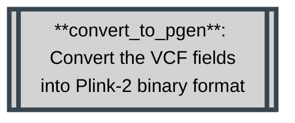

# Methodology
{: .no_toc }

A breakdown of the methodology and softwares used in this workflow.
{: .fs-6 .fw-300 }

`plink2`
{: .label }

`plink`
{: .label }

`bcftools`
{: .label }

`java -jar $PICCARD`
{: .label }


<details markdown="block">
  <summary>
    Table of contents
  </summary>
  {: .text-delta }
1. TOC
{:toc}
</details>

---

<details markdown="block">
  <summary>
    Rule Map/Diagram
  </summary>
  {: .text-delta }

  ```mermaid
---
title: Pharmacogenetics Analysis
---
flowchart TD
subgraph pharmacogeneticsWorkflow [Pharmacogenetics Workflow]
    direction BT

    classDef bcftools stroke:#FF5733,fill:#D3D3D3,stroke-width:4px,color:black;
    classDef plink stroke:#36454F,fill:#D3D3D3,stroke-width:4px,color:black;
    classDef python stroke:#FEBE10,fill:#D3D3D3,stroke-width:4px,color:black;
    classDef admixture stroke:#333,fill:#D3D3D3,stroke-width:4px,color:black;
    classDef tabix stroke:#023020,fill:#D3D3D3,stroke-width:4px,color:black;
    classDef gatk stroke:#007FFF,fill:#D3D3D3,stroke-width:4px,color:black;

    format_sample_metadata[[format_sample_metadata:\nTranspile cluster ownership from\nsample cluster assignment into\ninput format]]

    convert_to_pgen[[**convert_to_pgen**: \n Convert the VCF fields into Plink-2 binary format]]
    remove_unknown_samples[[**remove_unknown_samples**:\nSubset samples to labeled\nsamples in metadata files]]
    
    verify_records_against_reference_genome[[**verify_records_against_reference_genome**:\nCheck reference alleles against\nprovided reference genome]]
    
    filter_variant_missingness[[**filter_variant_missingness**:\nFilter variants with 100%\nmissingness]]
    
    filter_sample_missingness[[**filter_sample_missingness**:\nFilter samples with 100%\nmissingness]]

    remove_non_standard_chromosomes[[**remove_non_standard_chromosomes**:\nFilter out non-standard\nchromosomes]]

    calculate_sample_relatedness[[**calculate_sample_relatedness**:\nCalculate relatedness]]

    remove_related_samples[[**remove_related_samples**:\nremove a given list of]]

    extract_provided_coordinates[[**extract_provided_coordinates**:\nTrim the dataset to one of\nthe studied regions]]

    report_count_partitioned_per_cluster[[**report_count_partitioned_per_cluster**:\nPerform frequency analysis across each cluster]]

    report_hardy_weinberg_per_cluster[[**report_hardy_weinberg_per_cluster**: Perform HWE analysis across each cluster]]

    report_missingness_per_cluster[[**report_missingness_per_cluster**: Report the missingness rates observed across each cluster]]

    collect_variant_frequency[[**collect_variant_frequency**: Collect cluster-level variant frequency reports into one]]

    report_fishers_exact_with_corrections[[**report_fishers_exact_with_corrections**: Perform Fishers-Exact test with Bonferonni correction]]

    collect_autosomal_hardy_weinberg[[**collect_autosomal_hardy_weinberg**: Collect the HWE reports for autosomal locations]]

    collect_variant_missingness[[**collect_variant_missingness**: Collect all per-cluster variant missingness reports into one]]

    collect_variant_count[[**collect_variant_count**: Collect all per-cluster variant count reports into one]]

    query_variant_effect_predictions[[**query_variant_effect_predictions**: Perform API calls to E! Ensemble REST API to identify variants]]

    compile_variant_effect_predictions[[**compile_variant_effect_predictions**: Collect the RAW API payloads and extract relevant metrics]]

    consolidate_reports[[**consolidate_reports**: Consolidate all the generated reports into one]]

    class format_sample_metadata,query_variant_effect_predictions,compile_variant_effect_predictions,collect_autosomal_hardy_weinberg,collect_variant_count,collect_variant_frequency,collect_variant_missingness,report_fishers_exact_with_corrections,consolidate_reports python;

    class convert_to_pgen,verify_records_against_reference_genome,filter_variant_missingness,filter_sample_missingness,remove_non_standard_chromosomes,remove_unknown_samples,calculate_sample_relatedness,remove_related_samples,extract_provided_coordinates,report_count_partitioned_per_cluster,report_hardy_weinberg_per_cluster,report_missingness_per_cluster plink;

    subgraph multipleVcfProtocol [Multiple dataset protocol]
        direction LR
        multipleVcfProtocolStart(((Start)))
        ifMergeRequired{Is a \nmerge needed?}
        merge_datasets[[**merge_datasets**: \nMerge multiple incoming \ndatasets]]

        normalize_merged_datasets[[**normalize_merged_datasets**: normalize any multi-allelic records created by merge]]
        multipleVcfProtocolEnd(((End)))

        class merge_datasets,normalize_merged_datasets bcftools;
        multipleVcfProtocolStart --> ifMergeRequired
        ifMergeRequired --> |yes| merge_datasets --> normalize_merged_datasets --> multipleVcfProtocolEnd
        ifMergeRequired --> |No| multipleVcfProtocolEnd
    end

    format_sample_metadata --> remove_unknown_samples 
    format_sample_metadata --> convert_to_pgen
    
    multipleVcfProtocol --> convert_to_pgen --> verify_records_against_reference_genome --> remove_non_standard_chromosomes --> remove_unknown_samples --> filter_variant_missingness --> 
    

    filter_sample_missingness --> calculate_sample_relatedness --> remove_related_samples

    remove_related_samples --> extract_provided_coordinates

    extract_provided_coordinates --> report_count_partitioned_per_cluster & report_hardy_weinberg_per_cluster & report_missingness_per_cluster & report_fishers_exact_with_corrections & query_variant_effect_predictions

    query_variant_effect_predictions --> compile_variant_effect_predictions

    extract_provided_coordinates & report_hardy_weinberg_per_cluster --> collect_autosomal_hardy_weinberg
    
    extract_provided_coordinates & report_missingness_per_cluster --> collect_variant_missingness
    
    extract_provided_coordinates & report_count_partitioned_per_cluster --> collect_variant_frequency

    report_count_partitioned_per_cluster --> collect_variant_count

    

    extract_provided_coordinates & collect_variant_frequency & collect_variant_count & collect_autosomal_hardy_weinberg & collect_variant_missingness & compile_variant_effect_predictions --> consolidate_reports

    report_fishers_exact_with_corrections --> consolidate_reports


    
    


end 
subgraph ValidateVcfWorkflow [Validate VCF Workflow]
    wipeInfo[[**wipeInfo**:\nRemove INFO column for\ncomputational processing\n efficiency]]
    normalize[[**normalize**:\nNormalize all SNPs]]
    sort[[**sort**:\nEnsure correct variant order]]
    filter[[**filter**:\nRemove all variants\nexcept SNPs]]
    annotate[[**annotate**:\nAnnotate VCF against given\nreference VCF such as \n dbSNP, and rename any\nunknown variants.]]

    tabix[[**tabix**: Generate tabix-index for targeted decompression]]

    class tabix tabix;
    class wipeInfo,normalize,sort,filter,annotate bcftools;

    subgraph liftoverProtocol [Liftover]
        direction LR
        liftoverProtocolStart(((Start)))
        liftover[[liftover:\nPerform reference genome\nliftover]]
        liftoverProtocolEnd(((End)))
        ifLiftoverRequired{Is a\nliftover\nrequired?}

        liftoverProtocolStart --> ifLiftoverRequired
        ifLiftoverRequired --> |yes| liftover --> liftoverProtocolEnd
        ifLiftoverRequired --> |no| liftoverProtocolEnd
        class liftover gatk;
    end

    tabix --> wipeInfo & normalize & sort & filter & annotate
    wipeInfo --> normalize --> sort --> filter --> annotate --> liftoverProtocol
end
subgraph PopulationStructureWorkflow [Population Structure Workflow]
    remove_rare_variants[[**remove_rare_variants**: Remove all variants which are not good indicators of population structure by nature]]

    plinkPca[[**Plink_PCA**:\nPerform a PLINK-2.0 PCA]]
    
    plinkPed[[**plinkPed**:\nConvert to PLINK-1.9's PED\n format]]
    
    fetchPedLables[[**fetchPedLables**:\nGenerate Ind2Pop sample annotations\n file]]
    
    Admixture[[**Admixture**:\nPerform an admixture analysis]]
    
    report_fixation_index_per_cluster[[**report_fixation_index_per_cluster**: Report Fixation-index for the provided clusters]]

    class remove_rare_variants,plinkPca,plinkPed,report_fixation_index_per_cluster plink;
    class Admixture admixture;
    class fetchPedLables python;

    
    format_sample_metadata --> remove_rare_variants 

    remove_related_samples --> remove_rare_variants --> plinkPca & plinkPed & report_fixation_index_per_cluster
    plinkPed --> fetchPedLables --> Admixture

end

liftoverProtocol --> multipleVcfProtocol

END((Results))

Admixture --> END
plinkPca --> END
report_fixation_index_per_cluster --> END
consolidate_reports --> END
  ```

</details>

#### VCF Validation Workflow Rules

<details markdown="block">
  <summary>
    <code>clear_annotations</code>
  </summary>
  
  ```mermaid
  flowchart TD
  
    clear_annotations[[clear_annotations:\nRemove INFO column for\ncomputational processing\n efficiency]]
  
    classDef bcftools stroke:#FF5733,fill:#D3D3D3,stroke-width:4px,color:black;
    class clear_annotations bcftools;
  ```

  <dl>
    <dt>Function</dt>
    <dd>To remove the <code>INFO</code> and <code>FORMAT</code> columns on the incoming dataset. This is done to speed up computation time for downstream analysis.</dd>
    <dt>Command</dt>
    <dd><code>bcftools annotate -x INFO,FORMAT -Oz -o {output.vcf} {input.vcf}</code></dd>
    <dt>Parameters</dt>
    <dd>
      <dl>
        <dt><code>-x INFO,FORMAT</code></dt>
        <dd>Remove the <code>INFO</code> and <code>FORMAT</code> annotations from the input VCF file.</dd>
        <dt><code>-Oz</code></dt>
        <dd>Output format (<code>-Oz</code> denotes a BG-Zipped VCF output)</dd>
        <dt><code>-o {output.vcf}</code></dt>
        <dd>Output file.</dd>
      </dl>
    </dd>
  </dl>

</details>

<details markdown="block">
  <summary>
    <code>normalize_variant_records</code>
  </summary>
  
  ```mermaid
  flowchart TD
    normalize_variant_records[[normalize_variant_records:\nNormalize all SNPs]]

    classDef bcftools stroke:#FF5733,fill:#D3D3D3,stroke-width:4px,color:black;
    class normalize_variant_records bcftools;
  ```

  <dl>
    <dt>Function</dt>
    <dd>
    To normalize variant representations within the dataset provided. This involves the following:
      <ul>
      <li>decomposing multi-allelic records</li>
      <li>left-aligning all variants</li>
      <li>right-handed trimming to ensure parsimony</li>
      </ul>
    </dd>
    <dt>Command</dt>
    <dd><code>bcftools norm -m -any -O z -o {output.vcf} < {input.vcf}</code></dd>
    <dt>Parameters</dt>
    <dd>
      <dl>
        <dt><code>-m -any</code></dt>
        <dd>Decompose multi-allelic entries to bi-allelic entries (<code>-</code>) and merge both SNPs and INDELS into single records (<code>any</code>)</dd>
        <dt><code>-Oz</code></dt>
        <dd>Output format (<code>-Oz</code> denotes a BG-Zipped VCF output)</dd>
        <dt><code>-o {output.vcf}</code></dt>
        <dd>Output file.</dd>
      </dl>
    </dd>
  </dl>

</details>

<details markdown="block">
  <summary>
    <code>filter_variant_types</code>
  </summary>
  
  ```mermaid
  flowchart TD
    filter_variant_types[[filter_variant_types:\nRemove all variant types\nexcept SNPs]]
    
    classDef bcftools stroke:#FF5733,fill:#D3D3D3,stroke-width:4px,color:black;
    class filter_variant_types bcftools;
  ```

  <dl>
      <dt>Function</dt>
      <dd>
      To remove all variant types except SNPs</dd>
      <dt>Command</dt>
      <dd><code>bcftools view -v snps -f PASS -O z -o {output.vcf} < {input.vcf}</code></dd>
      <dt>Parameters</dt>
      <dd>
        <dl>
          <dt><code>-v snps</code></dt>
          <dd>Only include SNPs</dd>
          <dt><code>-f PASS</code></dt>
          <dd>Only select variants with <code>PASS</code> values.</dd>
          <dt><code>-Oz</code></dt>
          <dd>Output format (<code>-Oz</code> denotes a BG-Zipped VCF output)</dd>
          <dt><code>-o {output.vcf}</code></dt>
          <dd>Output file.</dd>
        </dl>
      </dd>
    </dl>

</details>
  
<details markdown="block">
  <summary>
    <code>sort_variant_records</code>
  </summary>
  
  ```mermaid
  flowchart TD
    sort_variant_records[[sort_variant_records:\nEnsure correct variant order]]
    
    classDef bcftools stroke:#FF5733,fill:#D3D3D3,stroke-width:4px,color:black;
    class sort_variant_records bcftools;
  ```

  This rule is responsible for sorting variants according to position, relative to the provided reference genome. This is important for downstream analysis which assumes ordered variants.

  <dl>
      <dt>Function</dt>
      <dd>
      To sort variants according to position, relative to the provided reference genome. This is important for downstream analysis which assumes ordered variants.</dd>
      <dt>Command</dt>
      <dd><code>bcftools sort -m {params.memory} -T {params.tmp} -O z -o {output.vcf} < {input.vcf}</code></dd>
      <dt>Parameters</dt>
      <dd>
        <dl>
          <dt><code>-m {params.memory} </code></dt>
          <dd>Provide a RAM memory available to the <code>bcftools sort</code> command.</dd>
          <dt><code>-T {params.tmp}</code></dt>
          <dd>Provide a location where `bcftools` can make a temporary folder to work from.</dd>
          <dt><code>-Oz</code></dt>
          <dd>Output format (<code>-Oz</code> denotes a BG-Zipped VCF output)</dd>
          <dt><code>-o {output.vcf}</code></dt>
          <dd>Output file.</dd>
        </dl>
      </dd>
    </dl>
    
</details>
  
<!-- 
<details markdown="block">
  <summary>
    <code>annotate</code>
  </summary>
  
  ```mermaid
  flowchart TD
    annotate[[annotate:\nAnnotate VCF against given\nreference VCF such as \n dbSNP, and rename any unknown\nvariants.]]
  ```

  <dl>
      <dt>Function</dt>
      <dd>
      To annotate the incoming data with variant IDs from the provided <code>resources/annotations.vcf.gz</code>, and rename any unknown variants.</dd>
      <dt>Command</dt>
      <dd><code>bcftools annotate -c ID -a {input.annotations} -O z -o {output.vcf} {input.vcf}</code></dd>
      <dt>Parameters</dt>
      <dd>
        <dl>
          <dt><code>-a {input.annotations}</code></dt>
          <dd>The VCF file that contains the desired annotations.</dd>
          <dt><code>-c ID</code></dt>
          <dd>Copy the <code>ID</code> column from the provided annotation VCF.</dd>
          <dt><code>-I +'%CHROM:%POS|%REF-%FIRST_ALT'</code></dt>
          <dd>Name all variants using the provided formula. The <code>+</code> indicates that this renaming logic should only be applied to variants which have no name, and is applied after retrieving annotations from the provided annotations VCF. <code>%CHROM</code> denotes the chromosome, <code>%POS</code> denotes the base-pair position of this variant, <code>%REF</code> denotes the reference allele at this location, and <code>%FIRST_ALT</code> denotes the first allele. Since this VCF file has been normalized and multi-allelic variants have already been decomposed to bi-allelic records, this will correspond to the only available allele for a loci.</dd>
          <dt><code>-O z</code></dt>
          <dd>Output format (<code>-Oz</code> denotes a BG-Zipped VCF output)</dd>
          <dt><code>-o {output.vcf}</code></dt>
          <dd>Output file.</dd>
        </dl>
      </dd>
    </dl>

</details> -->
<!-- 
<details markdown="block">
  <summary>
    <code>annotateUnknown</code>
  </summary>
  
  ```mermaid
  flowchart TD
    annotateUnknown[[annotateUnknown:\nName all un-annotated variants using \nstandardized naming conventions.]]
  ```

  <dl>
      <dt>Function</dt>
      <dd>
      To name all un-named variants which did not have a matching annotation ID.</dd>
      <dt>Command</dt>
      <dd><code>plink --vcf {input.vcf} --set-missing-var-ids @:#\$1-\$2 --new-id-max-allele-len 200 --out {params.output}</code></dd>
      <dt>Parameters</dt>
      <dd>
        <dl>
          <dt><code>--vcf {input.vcf}</code></dt>
          <dd>File path to the input VCF file via parameter.</dd>
          <dt><code>--set-missing-var-ids @:#\$1-\$2</code></dt>
          <dd>A string which describes a naming scheme to be used when setting all un-named variants <code>@</code> denotes the chromosome code, <code>#</code> denotes the base-pair coordinates, <code>$1</code> denotes the reference allele and <code>$2</code> denotes the alternate allele.</dd>
          <dt><code>--new-id-max-allele-len 200</code></dt>
          <dd>Sets a maximum allowed variant ID length.</dd>
          <dt><code>--out {params.output}</code></dt>
          <dd>Provide the file name and path for output creation.</dd>
        </dl>
      </dd>
    </dl>

</details> -->
  

#### Pharmacogenetics Workflow Rules

<details markdown="block">
  <summary>
    <code>format_sample_metadata</code>*
  </summary>
  
  ```mermaid
  flowchart TD
    subgraph multipleVcfProtocol [Multiple dataset protocol]
      direction LR
      multipleVcfProtocolStart(((Start)))
      ifMergeRequired{Is a \nmerge needed?}
      merge_datasets[[merge_datasets:\nMerge multiple incoming\ndatasets]]
      multipleVcfProtocolEnd(((End)))

      multipleVcfProtocolStart --> ifMergeRequired
      ifMergeRequired --> |yes| merge_datasets --> multipleVcfProtocolEnd
      ifMergeRequired --> |No| multipleVcfProtocolEnd
    end
  ```

</details>

<details markdown="block">
  <summary>
    <code>merge_datasets</code>*
  </summary>
  
  ```mermaid
  flowchart TD
    subgraph multipleVcfProtocol [Multiple dataset protocol]
      direction LR
      
        classDef bcftools stroke:#FF5733,fill:#D3D3D3,stroke-width:4px,color:black;
        multipleVcfProtocolStart(((Start)))
        ifMergeRequired{Is a \nmerge needed?}
        merge_datasets[[**merge_datasets**: \nMerge multiple incoming \ndatasets]]

        normalize_merged_datasets[[**normalize_merged_datasets**: normalize any multi-allelic records created by merge]]
        multipleVcfProtocolEnd(((End)))

        class merge_datasets,normalize_merged_datasets bcftools;
        multipleVcfProtocolStart --> ifMergeRequired
        ifMergeRequired --> |yes| merge_datasets --> normalize_merged_datasets --> multipleVcfProtocolEnd
        ifMergeRequired --> |No| multipleVcfProtocolEnd
    end
  ```
  {: .normal }
  > This rule only executes when multiple described datasets are detected. This rule is responsible for merging multiple datasets into a single VCF file, suitable for collective analysis.

 <dl>
      <dt>Function</dt>
      <dd>To perform reference-genome version liftovers.</dd>
      <dt>Command</dt>
      <dd><code>bcftools merge -O z -o {output} {input.vcf}</code></dd>
      <dt>Parameters</dt>
      <dd>
        <dl>
          <dt><code>-O z</code></dt>
          <dd>Output format (<code>-Oz</code> denotes a BG-Zipped VCF output)</dd>
          <dt><code>-o {output.vcf}</code></dt>
          <dd>Output file.</dd>
        </dl>
      </dd>
    </dl>

</details>


<details markdown="block">
    <summary>
        <code>convert_to_pgen</code>
    </summary>



<dl>
    <dt>Function</dt>
    <dd>To convert text-based VCF files into binary Plink-2 PGEN format which is much more performant.</dd>
    <dt>command</dt>
    <dd><code>plink2 --threads {threads} --vcf {input.vcf} --update-sex {input.sample_metadata} --split-par hg38 --allow-extra-chr --make-pgen vzs --out {params.output}</code></dd>
    <dt>Parameters</dt>
    <dd>
        <dl>
            <dt><code>--threads {threads}</code></dt>
            <dd>Used to set the number of CPU threads used during this calculation</dd>
            <dt><code>--vcf {input.vcf}</code></dt>
            <dd>Used to provide the location of the input file plink needs to work on.</dd>
            <dt><code>--update-sex {input.sample_metadata}</code></dt>
            <dd>Used to provide plink with sample annotations for downstream processing and use.</dd>
            <dt><code>--split-par hg38</code></dt>
            <dd>Used to indicate to plink to use standard coordinates for build hg38 when trimming off the PAR regions on chromosome X.</dd>
            <dt><code>--allow-extra-chr</code></dt>
            <dd>Used to indicate to Plink to expect non-standard chromosomes.</dd>
            <dt><code>--make-pgen vzs</code></dt>
            <dd>Used to indicate that output should be compiled in Plink-2 binary format (.pvar, .pgen and .psam files).</dd>
            <dt><code>--out {params.output}</code></dt>
            <dd>Used to declare the output location that should be used to create the file. File is specified without extension, which is added by Plink.</dd>
        </dl>
    </dd>
</dl>

</details>


<details markdown="block">
  <summary>
    <code>verify_records_against_reference_genome</code>
  </summary>
  
  ```mermaid
  flowchart TD
    classDef plink stroke:#36454F,fill:#D3D3D3,stroke-width:4px,color:black;

    verify_records_against_reference_genome[[verify_records_against_reference_genome:\nCheck reference alleles against\nprovided reference genome]]

    class verify_records_against_reference_genome plink;
  ```

 <dl>
      <dt>Function</dt>
      <dd>
      To check each loci and comparing its listed reference to that provided in the reference genome.</dd>
      <dt>Command</dt>
      <dd><code>plink2 --threads {threads} --pfile {params.input} vzs --fa {params.ref} --ref-from-fa force --allow-extra-chr --make-pgen vzs --out {params.output}</code></dd>
      <dt>Parameters</dt>
      <dd>
        <dl>
          <dt><code>--threads {threads}</code></dt>
          <dd>Used to set the number of CPU threads used during this calculation</dd>
          <dt><code>--pfile {params.input} vzs</code></dt>
          <dd>Used to provide plink with the location of a plink-2 binary file set (.psam, .pvar and .pgen files), and to expect z-compressed files.</dd>
          <dt><code>--fa {params.ref}</code></dt>
          <dd>File path to reference genome to be used for comparison.</dd>
          <dt><code>--ref-from-fa force</code></dt>
          <dd>Sets REF allele to provided reference FASTA when possible unambiguously (Does not apply to some INDELS)</dd>
          <dt><code>--allow-extra-chr</code></dt>
          <dd>Permits non-standard chromosome codes in input data</dd>
          <dt><code>--make-pgen zs</code></dt>
          <dd>Save output to a BG-Zipped pgen binary fileset.</dd>
          <dt><code>--out {params.output}</code></dt>
          <dd>Provide the file name and path for output creation.</dd>
        </dl>
      </dd>
    </dl>

</details>

<details markdown="block">
  <summary>
    <code>remove_non_standard_chromosomes</code>
  </summary>

  ```mermaid
  flowchart TD
    classDef plink stroke:#36454F,fill:#D3D3D3,stroke-width:4px,color:black;

    remove_non_standard_chromosomes[[remove_non_standard_chromosomes:\nFilter out non-standard\nchromosomes]]
    class remove_non_standard_chromosomes plink;
  ```

 <dl>
      <dt>Function</dt>
      <dd>
      To filter out non-standard chromosomes.</dd>
      <dt>Command</dt>
      <dd><code>plink2 --vcf {input.vcf} --allow-extra-chr --output-chr chr26 --chr 1-26 --export vcf-4.2 bgz --out results/COLLATE/chrFilter</code></dd>
      <dt>Parameters</dt>
      <dd>
        <dl>
          <dt><code>--vcf {input.vcf}</code></dt>
          <dd>File path to the input VCF file via parameter.</dd>
          <dt><code>--allow-extra-chr</code></dt>
          <dd>Permits non-standard chromosome codes in input data.</dd>
          <dt><code>--output-chr chr26</code></dt>
          <dd>Sets chromosome code notation in output files to include the 'chr' as a prefix.</dd>
          <dt><code>--chr 1-26</code></dt>
          <dd>Request a subset of chromosomes to be included in the output file.</dd>
          <dt><code>--export vcf-4.2 bgz</code></dt>
          <dd>Save output to a BG-Zipped VCF file using the VCF-4.2 specification.</dd>
          <dt><code>--out results/COLLATE/chrFilter</code></dt>
          <dd>Provide the file name and path for output creation.</dd>
        </dl>
      </dd>
    </dl>

</details>


<details markdown="block">
  <summary>
    <code>remove_unknown_samples</code>
  </summary>

  ```mermaid
  flowchart TD
    remove_unknown_samples[[remove_unknown_samples:\nSubset samples to labeled\nsamples in metadata files]]
  ```

 <dl>
      <dt>Function</dt>
      <dd>
      To remove unneeded samples. This is done by comparison against all provided sample annotations in the <code>input/samples.csv</code> metadata file.</dd>
      <dt>Command</dt>
      <dd><code>bcftools view -s {params.samples} -O z -o {output} {input.vcf}</code></dd>
      <dt>Parameters</dt>
      <dd>
        <dl>
          <dt><code>-s {params.samples}</code></dt>
          <dd>Provide a list of sample IDs to include in output.</dd>
          <dt><code>-O z</code></dt>
          <dd>Output format (<code>-Oz</code> denotes a BG-Zipped VCF output)</dd>
          <dt><code>-o {output}</code></dt>
          <dd>Output file.</dd>
        </dl>
      </dd>
    </dl>

</details>

<details markdown="block">
  <summary>
    <code>filter_variant_missingness</code>
  </summary>

  ```mermaid
  flowchart TD
    filter_variant_missingness[[filter_variant_missingness:\nFilter variants with 100%\nmissingness]]
  ```

 <dl>
      <dt>Function</dt>
      <dd>
      To manage and remove regions of missing calls along the variant-level.</dd>
      <dt>Command</dt>
      <dd><code>plink2 --chr 1-26 --allow-extra-chr --vcf {input} --geno 1.0 --output-chr chr26 --export vcf-4.2 bgz --out {params.output}</code></dd>
      <dt>Parameters</dt>
      <dd>
        <dl>
          <dt><code>--chr 1-26</code></dt>
          <dd>Request a subset of chromosomes to be included in the output file.</dd>
          <dt><code>--allow-extra-chr</code></dt>
          <dd>Permits non-standard chromosome codes in input data.</dd>
          <dt><code>--vcf {input.vcf}</code></dt>
          <dd>Removes all variants with a missing call rate exceeding <code>1.0</code></dd>
          <dt><code>--geno 1.0</code></dt>
          <dd>File path to the input VCF file via parameter.</dd>
          <dt><code>--output-chr chr26</code></dt>
          <dd>Sets chromosome code notation in output files to include the 'chr' as a prefix.</dd>
          <dt><code>--export vcf-4.2 bgz</code></dt>
          <dd>Save output to a BG-Zipped VCF file using the VCF-4.2 specification.</dd>
          <dt><code>--out {params.output}</code></dt>
          <dd>Provide the file name and path for output creation.</dd>
        </dl>
      </dd>
    </dl>

</details>

<details markdown="block">
  <summary>
    <code>filter_sample_missingness</code>
  </summary>

  ```mermaid
  flowchart TD
    filter_sample_missingness[[filter_sample_missingness:\nFilter samples with 100%\nmissingness]]
  ```

 <dl>
      <dt>Function</dt>
      <dd>
      To manage and remove regions of missing calls along the sample-level.</dd>
      <dt>Command</dt>
      <dd><code>plink2 --chr 1-26 --allow-extra-chr --vcf {input} --mind 1.0 --output-chr chr26 --export vcf-4.2 bgz --out {params.output}</code></dd>
      <dt>Parameters</dt>
      <dd>
        <dl>
          <dt><code>--chr 1-26</code></dt>
          <dd>Request a subset of chromosomes to be included in the output file.</dd>
          <dt><code>--allow-extra-chr</code></dt>
          <dd>Permits non-standard chromosome codes in input data.</dd>
          <dt><code>--vcf {input.vcf}</code></dt>
          <dd>File path to the input VCF file via parameter.</dd>
          <dt><code>--mind 1.0</code></dt>
          <dd>Removes all samples with a missing call rate exceeding <code>1.0</code></dd>
          <dt><code>--output-chr chr26</code></dt>
          <dd>Sets chromosome code notation in output files to include the 'chr' as a prefix.</dd>
          <dt><code>--export vcf-4.2 bgz</code></dt>
          <dd>Save output to a BG-Zipped VCF file using the VCF-4.2 specification.</dd>
          <dt><code>--out {params.output}</code></dt>
          <dd>Provide the file name and path for output creation.</dd>
        </dl>
      </dd>
    </dl>

</details>

<details markdown="block">
  <summary>
    <code>calculate_sample_relatedness</code>
  </summary>

  ```mermaid
  flowchart TD
    calculate_sample_relatedness[[calculate_sample_relatedness:\nCalculate Identity-By-Descent]]
  ```

 <dl>
      <dt>Function</dt>
      <dd>
      To calculate sample relatedness using a kingship estimator provided by Plink-2.</dd>
      <dt>Command</dt>
      <dd><code>plink --vcf {input} --allow-extra-chr --keep-allele-order --genome --min 0.2 --recode vcf-iid bgz --out {params.output}</code></dd>
      <dt>Parameters</dt>
      <dd>
        <dl>
          <dt><code>--vcf {input.vcf}</code></dt>
          <dd>File path to the input VCF file via parameter.</dd>
          <dt><code>--allow-extra-chr</code></dt>
          <dd>Permits non-standard chromosome codes in input data.</dd>
          <dt><code>--keep-allele-order</code></dt>
          <dd>Tells Plink-1.9 to maintain original A1/A2, otherwise major allele is set to A2.</dd>
          <dt><code>--genome</code></dt>
          <dd>Run an identity-by-descent report.</dd>
          <dt><code>--min 0.2</code></dt>
          <dd>Removes individuals with an IBD score below <code>0.2</code>.</dd>
          <dt><code>--recode vcf-iid bgz</code></dt>
          <dd>Sets output format to a BG-ZIpped VCF with individual-identifiers.</dd>
          <dt><code>--out {params.output}</code></dt>
          <dd>Provide the file name and path for output creation.</dd>
        </dl>
      </dd>
    </dl>

</details>

<details markdown="block">
  <summary>
    <code>remove_related_samples</code>
  </summary>

  ```mermaid
  flowchart TD
    remove_related_samples[[remove_related_samples:\nremove a given list of samples\nbased on IBD results]]
  ```

 <dl>
      <dt>Function</dt>
      <dd>
      To filter out all but unrelated samples, given the list of samples to keep from its predecessor rules.</dd>
      <dt>Command</dt>
      <dd><code>bcftools view {input.vcf} -S {input.samples} -O z -o {output}</code></dd>
      <dt>Parameters</dt>
      <dd>
        <dl>
          <dt><code>-S {input.vcf}</code></dt>
          <dd>A file containing a list of Sample IDs to include.</dd>
          <dt><code>-O z</code></dt>
          <dd>Output format (<code>-Oz</code> denotes a BG-Zipped VCF output)</dd>
          <dt><code>-o {output}</code></dt>
          <dd>Output file.</dd>
        </dl>
      </dd>
    </dl>

</details>

<details markdown="block">
  <summary>
    <code>extract_provided_coordinates</code>
  </summary>

  ```mermaid
  flowchart TD
    extract_provided_coordinates[[extract_provided_coordinates:\nTrim the dataset to one of\nthe studied regions]]
  ```

 <dl>
      <dt>Function</dt>
      <dd>
      To filter out all but unrelated samples, given the list of samples to keep from its predecessor rules.</dd>
      <dt>Command</dt>
      <dd><code>plink2 --allow-extra-chr --vcf {input} --from-bp {params.fromBP} --to-bp {params.toBP} --chr {params.chr} --output-chr chr26 --export vcf-4.2 bgz --out results/TRIM/ALL_{wildcards.location}</code></dd>
      <dt>Parameters</dt>
      <dd>
        <dl>
          <dt><code>--allow-extra-chr</code></dt>
          <dd>Permits non-standard chromosome codes in input data.</dd>
          <dt><code>--vcf {input.vcf}</code></dt>
          <dd>File path to the input VCF file via parameter.</dd>
          <dt><code>--from-bp {params.fromBP}</code></dt>
          <dd>Start coordinates for the region to trim to.</dd>
          <dt><code>--to-bp {params.toBP}</code></dt>
          <dd>Stop coordinates for the region to trim to.</dd>
          <dt><code>--chr {params.chr}</code></dt>
          <dd>The chromosome to trim on.</dd>
          <dt><code>--output-chr chr26</code></dt>
          <dd>Sets chromosome code notation in output files to include the 'chr' as a prefix.</dd>
          <dt><code>--export vcf-4.2 bgz</code></dt>
          <dd>Save output to a BG-Zipped VCF file using the VCF-4.2 specification.</dd>
          <dt><code>--out results/TRIM/ALL_{wildcards.location}</code></dt>
          <dd>Provide the file name and path for output creation.</dd>
        </dl>
      </dd>
    </dl>

</details>

<details markdown="block">
  <summary>
    <code>format_sample_metadata</code>
  </summary>

  ```mermaid
  flowchart TD
    format_sample_metadata[[format_sample_metadata:\nTranspile cluster ownership from\nsample cluster assignment into\ninput format]]
  ```
  
 <dl>
      <dt>Function</dt>
      <dd>To compile sample metadata.</dd>
      <dt>Command</dt>
      <dd><code>join("scripts", "01-TRANSPILE_CLUSTERS.py")</code></dd>
      <dt>Parameters</dt>
      <dd>
        <dl>
        <dt><code>input/samples.csv</code></dt>
        <dd>The sample information provided that should be used in this analysis.</dd>
        </dl>
      </dd>
    </dl>


</details>

<details markdown="block">
  <summary>
    <code>report_count_partitioned_per_cluster</code>
  </summary>

  ```mermaid
  flowchart TD
    report_count_partitioned_per_cluster[[report_count_partitioned_per_cluster:\nPerform frequency analysis]]
  ```

  <dl>
      <dt>Function</dt>
      <dd>
      To generate a frequency report.</dd>
      <dt>Command</dt>
      <dd><code>plink2 --allow-extra-chr --vcf {input.vcf} --freq counts --export vcf-4.2 bgz --out results/FINAL/$CLUSTER/{params.prefix}</code>, and <code>plink2 --allow-extra-chr --vcf {input.vcf} --pheno iid-only results/REFERENCE/cluster_$CLUSTER.txt --loop-cats $CLUSTER --freq counts --missing --hardy midp --out results/FINAL/$CLUSTER/{params.prefix}
        </code></dd>
      <dt>Parameters</dt>
      <dd>
        <dl>
          <dt><code>--allow-extra-chr</code></dt>
          <dd>Permits non-standard chromosome codes in input data.</dd>
          <dt><code>--vcf {input.vcf}</code></dt>
          <dd>File path to the input VCF file via parameter.</dd>
          <dt><code>--freq counts</code></dt>
          <dd>Generate a frequency report including variant count data.</dd>
          <dt><code>--export vcf-4.2 bgz</code></dt>
          <dd>Save output to a BG-Zipped VCF file using the VCF-4.2 specification.</dd>
          <dt><code>--out results/TRIM/ALL_{wildcards.location}</code></dt>
          <dd>Provide the file name and path for output creation.</dd>
          <dt><code>--pheno iid-only results/REFERENCE/cluster_$CLUSTER.txt</code></dt>
          <dd>Extract phenotype information from the given file by Sample ID.</dd>
          <dt><code>--loop-cats $CLUSTER</code></dt>
          <dd>Re-run this command and focus on the populated cluster (This command is designed to be executed in a bash for loop, where $CLUSTER is set each iteration).</dd>
          <dt><code>--missing</code></dt>
          <dd>Generate a missingness report for both samples and variants.</dd>
          <dt><code>--hardy midp</code></dt>
          <dd>Generate a Hardy-Weinburg report with Mid-P adjustments.</dd>
        </dl>
      </dd>
    </dl>

</details>

#### Population Structure Workflow Rules

<details markdown="block">
  <summary>
    <code>plinkPed</code>
  </summary>

  ```mermaid
  flowchart TD
    plinkPed[[plinkPed:\nConvert to PLINK-1.9's PED\n format]]
  ```

</details>

<details markdown="block">
  <summary>
    <code>fetchPedLables</code>
  </summary>

  ```mermaid
  flowchart TD
    fetchPedLables[[fetchPedLables:\nGenerate Ind2Pop sample annotations\n file]]
  ```

</details>

<details markdown="block">
  <summary>
    <code>Admixture</code>
  </summary>

  ```mermaid
  flowchart TD
    Admixture[[Admixture:\nPerform an admixture analysis]]
  ```

</details>

<details markdown="block">
  <summary>
    <code>plinkPca</code>
  </summary>

  ```mermaid
  flowchart TD
    plinkPca[[Plink_PCA:\nPerform a PLINK-2.0 PCA]]
  ```

</details>
