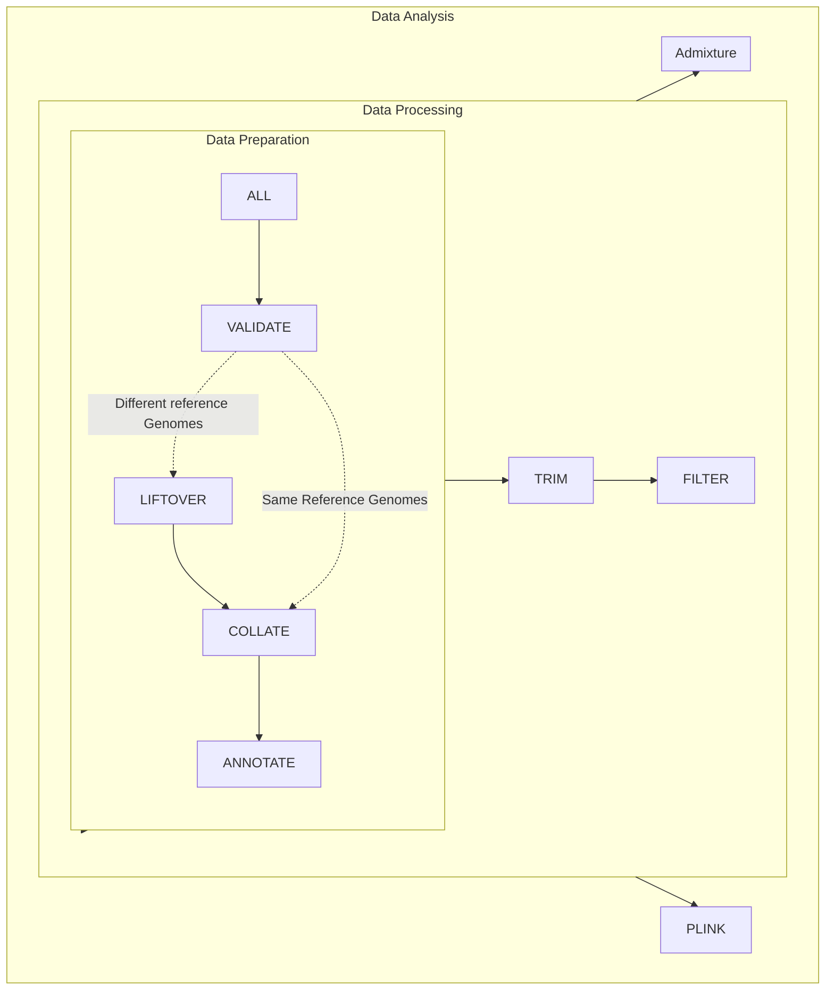

```mermaid
flowchart TB

    subgraph prep [Data Preparation]
        ALL --> VALIDATE
        VALIDATE -.->|Different reference Genomes| LIFTOVER
        LIFTOVER --> COLLATE
        VALIDATE -.->|Same Reference Genomes| COLLATE
        COLLATE --> ANNOTATE
    end
    subgraph processing [Data Processing]
        prep --> TRIM
        TRIM --> FILTER
    end

    subgraph admix [Admixture]
    end

    subgraph analysis [Data Analysis]
        processing ---> PLINK
        processing ---> admix
    end

    prep --> processing
```
