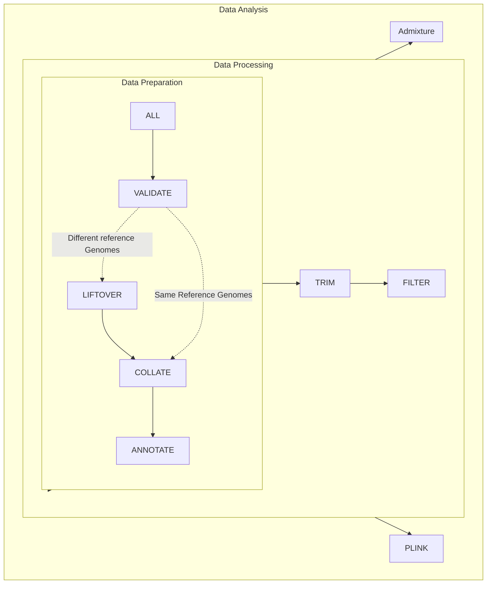

# Overview

The <i>{{ site.title }}</i> is a pipeline powered by <a href="https://snakemake.readthedocs.io/" target="_blank">Snakemake</a>, a python-based workflow management package. This project has been created with support for PBS-Torque scheduler environments on Linux servers.

Below is a diagram representing the pipeline flow and steps:

